# System Workflow Documentation

This document provides comprehensive workflow documentation with Mermaid diagrams for all major system workflows in MyMasjidApp.

## Table of Contents

1. [Authentication Workflows](#1-authentication-workflows)
   - User Registration (Student self-registration)
   - Login and Session Management
   - Password Recovery (Email & SMS methods)
2. [Student Management Workflows](#2-student-management-workflows)
   - Student Registration (Admin-created)
   - Student Enrollment to Classes
   - Student Profile Management
3. [Class Management Workflows](#3-class-management-workflows)
   - Class Creation
   - Class Assignment (Students to Classes)
   - Teacher Assignment to Classes
4. [Attendance Workflows](#4-attendance-workflows)
   - Marking Attendance (Individual & Bulk)
   - Attendance Tracking & History
   - Attendance Approval (with proof/document)
5. [Fee Management Workflows](#5-fee-management-workflows)
   - Fee Generation (Monthly)
   - Fee Payment Process
   - PIC Approval Workflow
   - Fee Document Confirmation
6. [Exam & Results Workflows](#6-exam--results-workflows)
   - Exam Creation
   - Result Entry & Management
   - Grade Calculation
7. [Role-Specific Workflows](#7-role-specific-workflows)
   - Admin Workflows
   - Teacher Workflows
   - Student Workflows
   - IB (Payment Approver) Workflows
8. [System-Level Workflows](#8-system-level-workflows)
   - Yearly Database Migration
   - Admin Actions & Snapshots

---

## 1. Authentication Workflows

### 1.1 User Registration (Student Self-Registration)

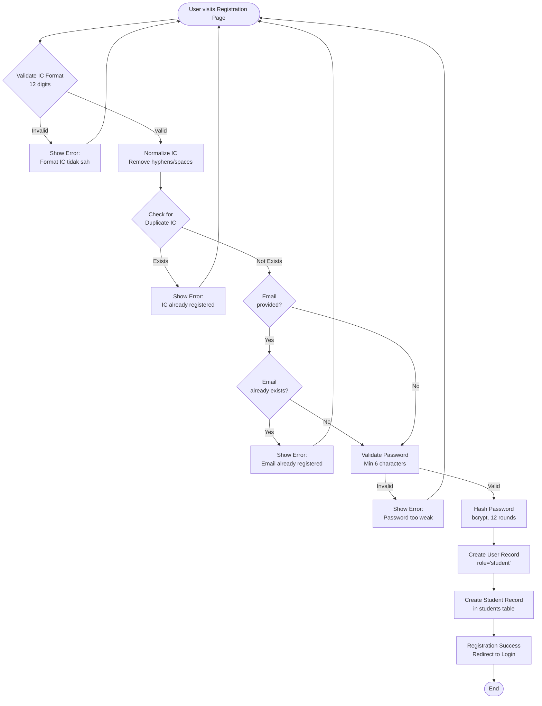
```mermaid
flowchart TD
    Start([User visits Registration Page]) --> ValidateIC{Validate IC Format<br/>12 digits}
    ValidateIC -->|Invalid| ShowError[Show Error:<br/>Format IC tidak sah]
    ShowError --> Start
    ValidateIC -->|Valid| NormalizeIC[Normalize IC<br/>Remove hyphens/spaces]
    NormalizeIC --> CheckDuplicate{Check for<br/>Duplicate IC}
    CheckDuplicate -->|Exists| ShowDuplicateError[Show Error:<br/>IC already registered]
    ShowDuplicateError --> Start
    CheckDuplicate -->|Not Exists| ValidateEmail{Email<br/>provided?}
    ValidateEmail -->|Yes| CheckEmailDuplicate{Email<br/>already exists?}
    CheckEmailDuplicate -->|Yes| ShowEmailError[Show Error:<br/>Email already registered]
    ShowEmailError --> Start
    CheckEmailDuplicate -->|No| ValidatePassword[Validate Password<br/>Min 6 characters]
    ValidateEmail -->|No| ValidatePassword
    ValidatePassword -->|Invalid| ShowPasswordError[Show Error:<br/>Password too weak]
    ShowPasswordError --> Start
    ValidatePassword -->|Valid| HashPassword[Hash Password<br/>bcrypt, 12 rounds]
    HashPassword --> CreateUser[Create User Record<br/>role='student']
    CreateUser --> CreateStudent[Create Student Record<br/>in students table]
    CreateStudent --> Success[Registration Success<br/>Redirect to Login]
    Success --> End([End])
```

**Key Steps:**
1. User enters IC number, name, email (optional), password (optional), phone, age
2. System validates IC format (12 digits)
3. System normalizes IC (removes hyphens/spaces)
4. System checks for duplicate IC/email
5. If password provided, system validates strength (min 6 chars)
6. System hashes password with bcrypt (12 rounds)
7. System creates user record with role='student'
8. System creates student record in students table
9. User is redirected to login page

**API Endpoint:** `POST /auth/register`

**Database Tables:**
- `users` - Main user record
- `students` - Student-specific data

**Error Handling:**
- Invalid IC format → "Format IC tidak sah. Sila masukkan 12 digit nombor IC."
- Duplicate IC → "IC number already registered"
- Duplicate email → "Emel ini sudah didaftarkan. Sila gunakan emel lain atau log masuk."
- Weak password → Password strength validation message

---

### 1.2 Login and Session Management

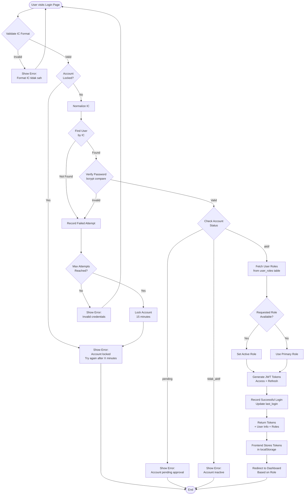
```mermaid
flowchart TD
    Start([User visits Login Page]) --> ValidateIC{Validate IC Format}
    ValidateIC -->|Invalid| ShowError[Show Error:<br/>Format IC tidak sah]
    ShowError --> Start
    ValidateIC -->|Valid| CheckLocked{Account<br/>Locked?}
    CheckLocked -->|Yes| ShowLockedError[Show Error:<br/>Account locked<br/>Try again after X minutes]
    ShowLockedError --> End([End])
    CheckLocked -->|No| NormalizeIC[Normalize IC]
    NormalizeIC --> FindUser{Find User<br/>by IC}
    FindUser -->|Not Found| RecordFailedAttempt[Record Failed Attempt]
    RecordFailedAttempt --> CheckMaxAttempts{Max Attempts<br/>Reached?}
    CheckMaxAttempts -->|Yes| LockAccount[Lock Account<br/>15 minutes]
    LockAccount --> ShowLockedError
    CheckMaxAttempts -->|No| ShowLoginError[Show Error:<br/>Invalid credentials]
    ShowLoginError --> Start
    FindUser -->|Found| VerifyPassword{Verify Password<br/>bcrypt compare}
    VerifyPassword -->|Invalid| RecordFailedAttempt
    VerifyPassword -->|Valid| CheckStatus{Check Account<br/>Status}
    CheckStatus -->|pending| ShowPendingError[Show Error:<br/>Account pending approval]
    ShowPendingError --> End
    CheckStatus -->|tidak_aktif| ShowInactiveError[Show Error:<br/>Account inactive]
    ShowInactiveError --> End
    CheckStatus -->|aktif| FetchRoles[Fetch User Roles<br/>from user_roles table]
    FetchRoles --> DetermineActiveRole{Requested Role<br/>Available?}
    DetermineActiveRole -->|Yes| SetActiveRole[Set Active Role]
    DetermineActiveRole -->|No| UsePrimaryRole[Use Primary Role]
    SetActiveRole --> GenerateTokens[Generate JWT Tokens<br/>Access + Refresh]
    UsePrimaryRole --> GenerateTokens
    GenerateTokens --> RecordSuccess[Record Successful Login<br/>Update last_login]
    RecordSuccess --> ReturnTokens[Return Tokens<br/>+ User Info + Roles]
    ReturnTokens --> StoreTokens[Frontend Stores Tokens<br/>in localStorage]
    StoreTokens --> Redirect[Redirect to Dashboard<br/>Based on Role]
    Redirect --> End
```

**Key Steps:**
1. User enters IC number and password
2. System validates IC format
3. System checks if account is locked (too many failed attempts)
4. System normalizes IC and finds user
5. System verifies password using bcrypt
6. System checks account status (pending/aktif/tidak_aktif)
7. System fetches all user roles from `user_roles` table
8. System determines active role (requested role if available, else primary role)
9. System generates JWT access token (24h) and refresh token (7 days)
10. System records successful login and updates `last_login`
11. Frontend stores tokens and redirects to role-appropriate dashboard

**API Endpoint:** `POST /auth/login`

**Database Tables:**
- `users` - User authentication data
- `user_roles` - User role assignments
- `login_attempts` - Failed login tracking

**Session Management:**
- Access Token: 24 hours validity
- Refresh Token: 7 days validity (if implemented)
- Tokens stored in localStorage (frontend)

**Security Features:**
- Account lockout after 5 failed attempts (15 minutes)
- Password hashing with bcrypt (12 rounds)
- Role-based access control (RBAC)

---

### 1.3 Password Recovery (Email & SMS Methods)

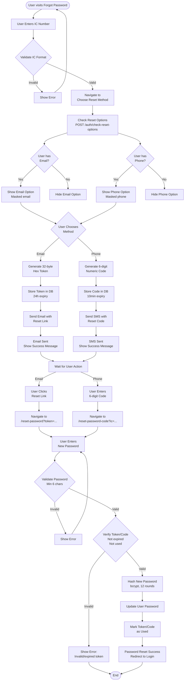
```mermaid
flowchart TD
    Start([User visits Forgot Password]) --> EnterIC[User Enters IC Number]
    EnterIC --> ValidateIC{Validate IC Format}
    ValidateIC -->|Invalid| ShowError[Show Error]
    ShowError --> Start
    ValidateIC -->|Valid| NavigateToMethod[Navigate to<br/>Choose Reset Method]
    NavigateToMethod --> CheckOptions[Check Reset Options<br/>POST /auth/check-reset-options]
    CheckOptions --> HasEmail{User has<br/>Email?}
    HasEmail -->|Yes| ShowEmailOption[Show Email Option<br/>Masked email]
    HasEmail -->|No| HideEmailOption[Hide Email Option]
    CheckOptions --> HasPhone{User has<br/>Phone?}
    HasPhone -->|Yes| ShowPhoneOption[Show Phone Option<br/>Masked phone]
    HasPhone -->|No| HidePhoneOption[Hide Phone Option]
    ShowEmailOption --> UserChooses{User Chooses<br/>Method}
    ShowPhoneOption --> UserChooses
    UserChooses -->|Email| GenerateEmailToken[Generate 32-byte<br/>Hex Token]
    GenerateEmailToken --> StoreToken[Store Token in DB<br/>24h expiry]
    StoreToken --> SendEmail[Send Email with<br/>Reset Link]
    SendEmail --> EmailSent[Email Sent<br/>Show Success Message]
    UserChooses -->|Phone| GenerateCode[Generate 6-digit<br/>Numeric Code]
    GenerateCode --> StoreCode[Store Code in DB<br/>10min expiry]
    StoreCode --> SendSMS[Send SMS with<br/>Reset Code]
    SendSMS --> SMSSent[SMS Sent<br/>Show Success Message]
    EmailSent --> WaitForUser[Wait for User Action]
    SMSSent --> WaitForUser
    WaitForUser -->|Email| UserClicksLink[User Clicks<br/>Reset Link]
    UserClicksLink --> NavigateToReset[Navigate to<br/>/reset-password?token=...]
    NavigateToReset --> EnterNewPassword[User Enters<br/>New Password]
    WaitForUser -->|Phone| UserEntersCode[User Enters<br/>6-digit Code]
    UserEntersCode --> NavigateToCodeReset[Navigate to<br/>/reset-password-code?ic=...]
    NavigateToCodeReset --> EnterNewPassword
    EnterNewPassword --> ValidatePassword{Validate Password<br/>Min 6 chars}
    ValidatePassword -->|Invalid| ShowPasswordError[Show Error]
    ShowPasswordError --> EnterNewPassword
    ValidatePassword -->|Valid| VerifyToken{Verify Token/Code<br/>Not expired<br/>Not used}
    VerifyToken -->|Invalid| ShowTokenError[Show Error:<br/>Invalid/expired token]
    ShowTokenError --> End([End])
    VerifyToken -->|Valid| HashNewPassword[Hash New Password<br/>bcrypt, 12 rounds]
    HashNewPassword --> UpdatePassword[Update User Password]
    UpdatePassword --> MarkTokenUsed[Mark Token/Code<br/>as Used]
    MarkTokenUsed --> Success[Password Reset Success<br/>Redirect to Login]
    Success --> End
```

**Key Steps:**

**Email Method:**
1. User enters IC number on forgot password page
2. System checks available reset methods (email/phone)
3. User selects email method
4. System generates 32-byte hexadecimal token
5. System stores token in `password_reset_tokens` table (24h expiry)
6. System sends email with reset link: `{FRONTEND_URL}/reset-password?token={token}`
7. User clicks link and enters new password
8. System validates token (not expired, not used)
9. System hashes new password and updates user record
10. System marks token as used
11. User redirected to login page

**Phone Method:**
1. User enters IC number on forgot password page
2. System checks available reset methods (email/phone)
3. User selects phone method
4. System generates 6-digit numeric code
5. System stores code in `password_reset_tokens` table (10min expiry)
6. System sends SMS with reset code
7. User navigates to `/reset-password-code?ic={icNumber}` and enters code
8. System validates code (not expired, not used)
9. System hashes new password and updates user record
10. System marks code as used
11. User redirected to login page

**API Endpoints:**
- `POST /auth/check-reset-options` - Check available reset methods
- `POST /auth/request-reset-email` - Request email reset
- `POST /auth/request-reset-phone` - Request phone reset
- `POST /auth/reset-password` - Reset password with token/code

**Database Tables:**
- `password_reset_tokens` - Stores reset tokens/codes
- `users` - User password storage

**Security Features:**
- Email tokens: 24-hour expiry, one-time use
- Phone codes: 10-minute expiry, one-time use
- User enumeration prevention (generic messages)
- Password strength validation (min 6 characters)

---

## 2. Student Management Workflows

### 2.1 Student Registration (Admin-Created)

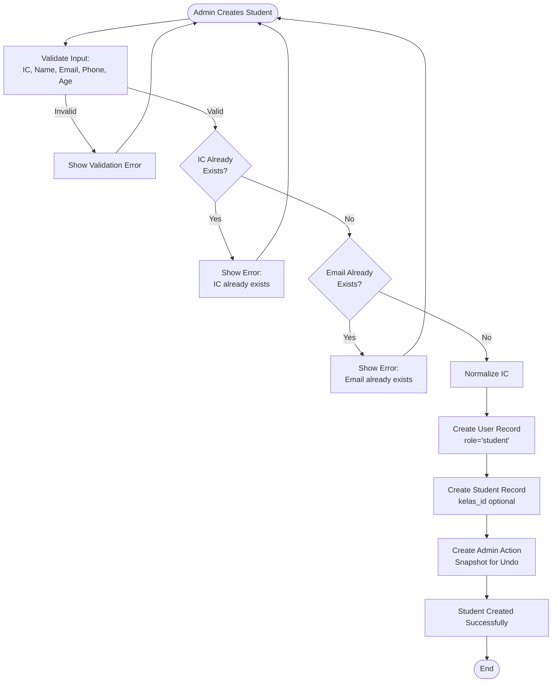
```mermaid
flowchart TD
    Start([Admin Creates Student]) --> ValidateInput[Validate Input:<br/>IC, Name, Email, Phone, Age]
    ValidateInput -->|Invalid| ShowError[Show Validation Error]
    ShowError --> Start
    ValidateInput -->|Valid| CheckICExists{IC Already<br/>Exists?}
    CheckICExists -->|Yes| ShowICError[Show Error:<br/>IC already exists]
    ShowICError --> Start
    CheckICExists -->|No| CheckEmailExists{Email Already<br/>Exists?}
    CheckEmailExists -->|Yes| ShowEmailError[Show Error:<br/>Email already exists]
    ShowEmailError --> Start
    CheckEmailExists -->|No| NormalizeIC[Normalize IC]
    NormalizeIC --> CreateUser[Create User Record<br/>role='student']
    CreateUser --> CreateStudent[Create Student Record<br/>kelas_id optional]
    CreateStudent --> CreateSnapshot[Create Admin Action<br/>Snapshot for Undo]
    CreateSnapshot --> Success[Student Created Successfully]
    Success --> End([End])
```

**Key Steps:**
1. Admin enters student details (IC, name, email, phone, age, address)
2. System validates all input fields
3. System checks for duplicate IC/email
4. System normalizes IC format
5. System creates user record with role='student'
6. System creates student record (class assignment optional)
7. System creates admin action snapshot (for undo functionality)
8. Success response returned

**API Endpoint:** `POST /students` (Admin only)

**Database Tables:**
- `users` - User record
- `students` - Student record (links to class)
- `admin_action_snapshots` - Undo tracking

---

### 2.2 Student Enrollment to Classes

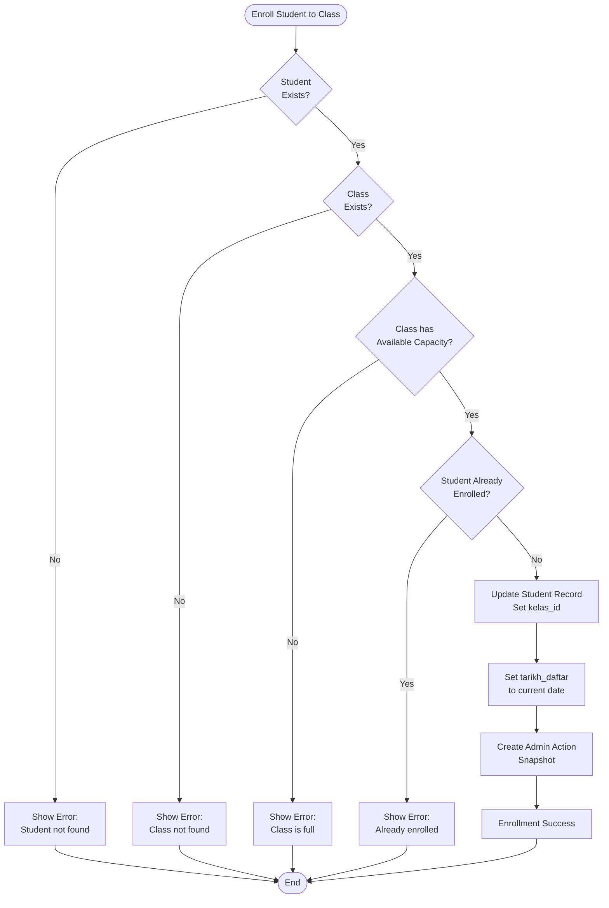
```mermaid
flowchart TD
    Start([Enroll Student to Class]) --> ValidateStudent{Student<br/>Exists?}
    ValidateStudent -->|No| ShowError[Show Error:<br/>Student not found]
    ShowError --> End([End])
    ValidateStudent -->|Yes| ValidateClass{Class<br/>Exists?}
    ValidateClass -->|No| ShowClassError[Show Error:<br/>Class not found]
    ShowClassError --> End
    ValidateClass -->|Yes| CheckCapacity{Class has<br/>Available Capacity?}
    CheckCapacity -->|No| ShowCapacityError[Show Error:<br/>Class is full]
    ShowCapacityError --> End
    CheckCapacity -->|Yes| CheckAlreadyEnrolled{Student Already<br/>Enrolled?}
    CheckAlreadyEnrolled -->|Yes| ShowEnrolledError[Show Error:<br/>Already enrolled]
    ShowEnrolledError --> End
    CheckAlreadyEnrolled -->|No| UpdateStudent[Update Student Record<br/>Set kelas_id]
    UpdateStudent --> UpdateEnrollmentDate[Set tarikh_daftar<br/>to current date]
    UpdateEnrollmentDate --> CreateSnapshot[Create Admin Action<br/>Snapshot]
    CreateSnapshot --> Success[Enrollment Success]
    Success --> End
```

**Key Steps:**
1. Admin selects student and class
2. System validates student exists
3. System validates class exists
4. System checks class capacity (kapasiti field)
5. System checks if student already enrolled
6. System updates student record with `kelas_id`
7. System sets enrollment date (`tarikh_daftar`)
8. System creates admin action snapshot
9. Success response returned

**API Endpoint:** `PUT /students/:ic` (Admin/Teacher)

**Database Tables:**
- `students` - Student enrollment data
- `classes` - Class capacity tracking

---

### 2.3 Student Profile Management

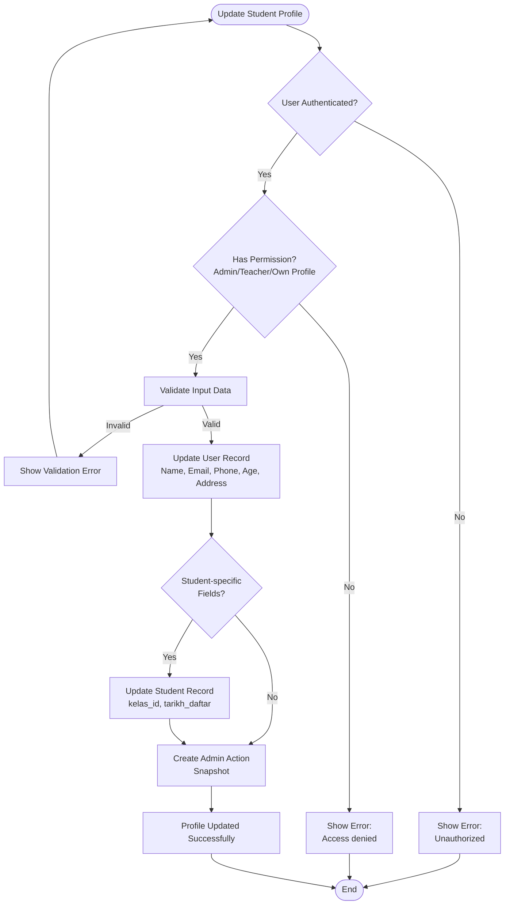
```mermaid
flowchart TD
    Start([Update Student Profile]) --> Authenticate{User Authenticated?}
    Authenticate -->|No| ShowAuthError[Show Error:<br/>Unauthorized]
    ShowAuthError --> End([End])
    Authenticate -->|Yes| CheckPermission{Has Permission?<br/>Admin/Teacher/Own Profile}
    CheckPermission -->|No| ShowPermissionError[Show Error:<br/>Access denied]
    ShowPermissionError --> End
    CheckPermission -->|Yes| ValidateInput[Validate Input Data]
    ValidateInput -->|Invalid| ShowValidationError[Show Validation Error]
    ShowValidationError --> Start
    ValidateInput -->|Valid| UpdateUser[Update User Record<br/>Name, Email, Phone, Age, Address]
    UpdateUser --> UpdateStudent{Student-specific<br/>Fields?}
    UpdateStudent -->|Yes| UpdateStudentRecord[Update Student Record<br/>kelas_id, tarikh_daftar]
    UpdateStudent -->|No| CreateSnapshot[Create Admin Action<br/>Snapshot]
    UpdateStudentRecord --> CreateSnapshot
    CreateSnapshot --> Success[Profile Updated Successfully]
    Success --> End
```

**Key Steps:**
1. User requests to update student profile
2. System authenticates user
3. System checks permissions (admin can update any, teacher can update their students, student can update own)
4. System validates input data
5. System updates user record (name, email, phone, age, address)
6. If student-specific fields changed, update students table
7. System creates admin action snapshot (if admin action)
8. Success response returned

**API Endpoint:** `PUT /students/:ic` (Admin/Teacher/Student for own profile)

**Database Tables:**
- `users` - User profile data
- `students` - Student-specific data

---

## 3. Class Management Workflows

### 3.1 Class Creation

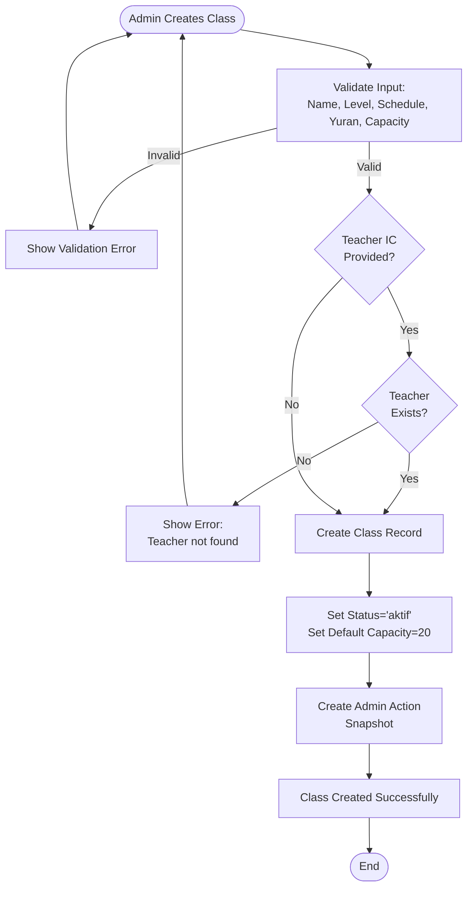
```mermaid
flowchart TD
    Start([Admin Creates Class]) --> ValidateInput[Validate Input:<br/>Name, Level, Schedule, Yuran, Capacity]
    ValidateInput -->|Invalid| ShowError[Show Validation Error]
    ShowError --> Start
    ValidateInput -->|Valid| ValidateTeacher{Teacher IC<br/>Provided?}
    ValidateTeacher -->|Yes| CheckTeacherExists{Teacher<br/>Exists?}
    CheckTeacherExists -->|No| ShowTeacherError[Show Error:<br/>Teacher not found]
    ShowTeacherError --> Start
    CheckTeacherExists -->|Yes| CreateClass[Create Class Record]
    ValidateTeacher -->|No| CreateClass
    CreateClass --> SetDefaultStatus[Set Status='aktif'<br/>Set Default Capacity=20]
    SetDefaultStatus --> CreateSnapshot[Create Admin Action<br/>Snapshot]
    CreateSnapshot --> Success[Class Created Successfully]
    Success --> End([End])
```

**Key Steps:**
1. Admin enters class details (name, level, schedule, sessions, yuran, teacher IC, capacity)
2. System validates all input fields
3. If teacher IC provided, system validates teacher exists
4. System creates class record
5. System sets default status='aktif' and capacity=20 if not specified
6. System creates admin action snapshot
7. Success response returned

**API Endpoint:** `POST /classes` (Admin only)

**Database Tables:**
- `classes` - Class information
- `users` - Teacher reference (guru_ic)
- `admin_action_snapshots` - Undo tracking

---

### 3.2 Class Assignment (Students to Classes)

This workflow is covered in [Section 2.2 Student Enrollment to Classes](#22-student-enrollment-to-classes).

---

### 3.3 Teacher Assignment to Classes

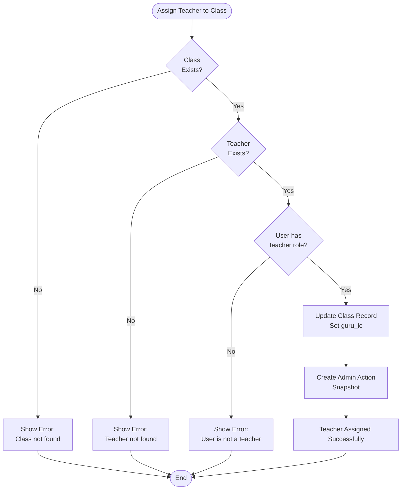
```mermaid
flowchart TD
    Start([Assign Teacher to Class]) --> ValidateClass{Class<br/>Exists?}
    ValidateClass -->|No| ShowClassError[Show Error:<br/>Class not found]
    ShowClassError --> End([End])
    ValidateClass -->|Yes| ValidateTeacher{Teacher<br/>Exists?}
    ValidateTeacher -->|No| ShowTeacherError[Show Error:<br/>Teacher not found]
    ShowTeacherError --> End
    ValidateTeacher -->|Yes| CheckTeacherRole{User has<br/>teacher role?}
    CheckTeacherRole -->|No| ShowRoleError[Show Error:<br/>User is not a teacher]
    ShowRoleError --> End
    CheckTeacherRole -->|Yes| UpdateClass[Update Class Record<br/>Set guru_ic]
    UpdateClass --> CreateSnapshot[Create Admin Action<br/>Snapshot]
    CreateSnapshot --> Success[Teacher Assigned Successfully]
    Success --> End
```

**Key Steps:**
1. Admin selects class and teacher
2. System validates class exists
3. System validates teacher exists and has teacher role
4. System updates class record with `guru_ic`
5. System creates admin action snapshot
6. Success response returned

**API Endpoint:** `PUT /classes/:id` (Admin only)

**Database Tables:**
- `classes` - Class teacher assignment
- `users` - Teacher validation
- `admin_action_snapshots` - Undo tracking

---

## 4. Attendance Workflows

### 4.1 Marking Attendance (Individual & Bulk)

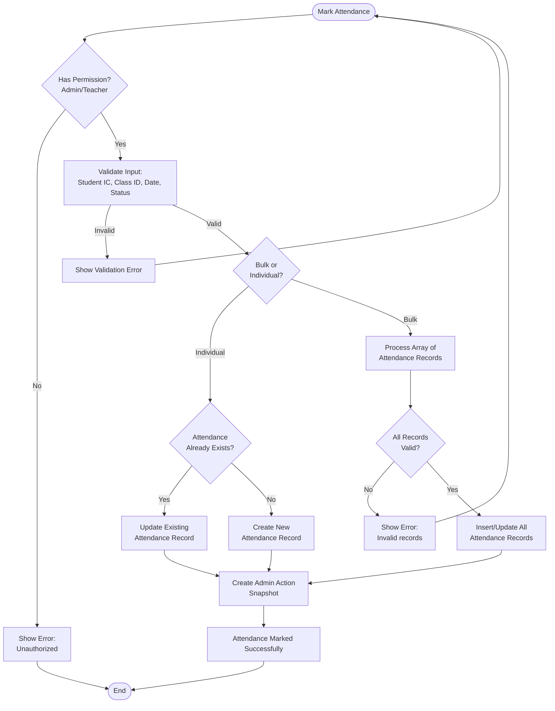
```mermaid
flowchart TD
    Start([Mark Attendance]) --> CheckPermission{Has Permission?<br/>Admin/Teacher}
    CheckPermission -->|No| ShowError[Show Error:<br/>Unauthorized]
    ShowError --> End([End])
    CheckPermission -->|Yes| ValidateInput[Validate Input:<br/>Student IC, Class ID, Date, Status]
    ValidateInput -->|Invalid| ShowValidationError[Show Validation Error]
    ShowValidationError --> Start
    ValidateInput -->|Valid| CheckBulk{Bulk or<br/>Individual?}
    CheckBulk -->|Individual| CheckExisting{Attendance<br/>Already Exists?}
    CheckExisting -->|Yes| UpdateAttendance[Update Existing<br/>Attendance Record]
    CheckExisting -->|No| CreateAttendance[Create New<br/>Attendance Record]
    CheckBulk -->|Bulk| ProcessBulk[Process Array of<br/>Attendance Records]
    ProcessBulk --> ValidateAll{All Records<br/>Valid?}
    ValidateAll -->|No| ShowBulkError[Show Error:<br/>Invalid records]
    ShowBulkError --> Start
    ValidateAll -->|Yes| BulkInsert[Insert/Update All<br/>Attendance Records]
    UpdateAttendance --> CreateSnapshot[Create Admin Action<br/>Snapshot]
    CreateAttendance --> CreateSnapshot
    BulkInsert --> CreateSnapshot
    CreateSnapshot --> Success[Attendance Marked Successfully]
    Success --> End
```

**Key Steps:**
1. Teacher/Admin selects class and date
2. System validates permissions (admin or teacher of the class)
3. For individual: System validates student IC, class ID, date, status
4. For bulk: System validates array of attendance records
5. System checks if attendance already exists for student+class+date
6. If exists: Update existing record
7. If not exists: Create new record
8. System creates admin action snapshot
9. Success response returned

**API Endpoints:**
- `POST /attendance` - Mark individual attendance
- `POST /attendance/bulk` - Mark bulk attendance

**Database Tables:**
- `attendance` - Attendance records
- `admin_action_snapshots` - Undo tracking

**Attendance Status Values:**
- `Hadir` - Present
- `Tidak Hadir` - Absent
- `Cuti` - On Leave

---

### 4.2 Attendance Tracking & History

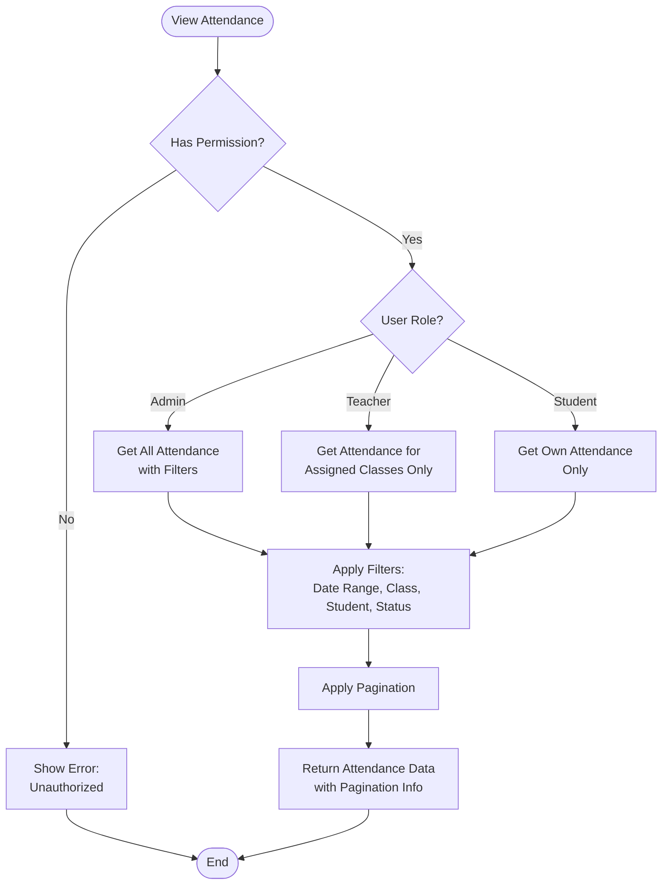
```mermaid
flowchart TD
    Start([View Attendance]) --> CheckPermission{Has Permission?}
    CheckPermission -->|No| ShowError[Show Error:<br/>Unauthorized]
    ShowError --> End([End])
    CheckPermission -->|Yes| CheckRole{User Role?}
    CheckRole -->|Admin| GetAllAttendance[Get All Attendance<br/>with Filters]
    CheckRole -->|Teacher| GetClassAttendance[Get Attendance for<br/>Assigned Classes Only]
    CheckRole -->|Student| GetOwnAttendance[Get Own Attendance<br/>Only]
    GetAllAttendance --> ApplyFilters[Apply Filters:<br/>Date Range, Class, Student, Status]
    GetClassAttendance --> ApplyFilters
    GetOwnAttendance --> ApplyFilters
    ApplyFilters --> Paginate[Apply Pagination]
    Paginate --> ReturnData[Return Attendance Data<br/>with Pagination Info]
    ReturnData --> End
```

**Key Steps:**
1. User requests attendance data
2. System checks user permissions
3. System applies role-based filtering:
   - Admin: All attendance records
   - Teacher: Only their assigned classes
   - Student: Only their own attendance
4. System applies optional filters (date range, class, student, status)
5. System applies pagination
6. System returns attendance data with pagination metadata

**API Endpoint:** `GET /attendance` (with query parameters)

**Query Parameters:**
- `start_date` - Start date (YYYY-MM-DD)
- `end_date` - End date (YYYY-MM-DD)
- `date` - Single date or month (YYYY-MM or YYYY-MM-DD)
- `class_id` - Filter by class
- `student_ic` - Filter by student
- `status` - Filter by status
- `page` - Page number
- `limit` - Records per page

**Database Tables:**
- `attendance` - Attendance records
- `classes` - Class information (for teacher filtering)
- `students` - Student information

---

### 4.3 Attendance Approval (with proof/document)

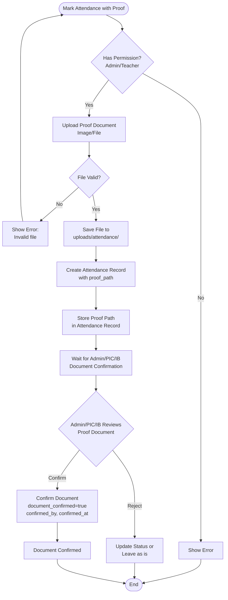
```mermaid
flowchart TD
    Start([Mark Attendance with Proof]) --> CheckPermission{Has Permission?<br/>Admin/Teacher}
    CheckPermission -->|No| ShowError[Show Error]
    ShowError --> End([End])
    CheckPermission -->|Yes| UploadProof[Upload Proof Document<br/>Image/File]
    UploadProof --> ValidateFile{File Valid?}
    ValidateFile -->|No| ShowFileError[Show Error:<br/>Invalid file]
    ShowFileError --> Start
    ValidateFile -->|Yes| SaveFile[Save File to<br/>uploads/attendance/]
    SaveFile --> CreateAttendance[Create Attendance Record<br/>with proof_path]
    CreateAttendance --> StoreProofPath[Store Proof Path<br/>in Attendance Record]
    StoreProofPath --> WaitConfirmation[Wait for Admin/PIC/IB<br/>Document Confirmation]
    WaitConfirmation --> AdminReviews{Admin/PIC/IB Reviews<br/>Proof Document}
    AdminReviews -->|Confirm| ConfirmDocument[Confirm Document<br/>document_confirmed=true<br/>confirmed_by, confirmed_at]
    AdminReviews -->|Reject| SetRejected[Update Status or<br/>Leave as is]
    ConfirmDocument --> Success[Document Confirmed]
    SetRejected --> End
    Success --> End
```

**Key Steps:**
1. Teacher marks attendance with proof document
2. System uploads and validates file
3. System saves file to `uploads/attendance/` directory
4. System creates attendance record with `proof_path` (proof stored in attendance record)
5. Admin/PIC/IB reviews proof document via confirm document endpoint
6. Admin/PIC/IB confirms or rejects document
7. If confirmed: System sets `document_confirmed=true` and records confirmation details
8. If rejected: System can update status or leave as is

**API Endpoints:**
- `POST /attendance/bulk-with-proof` - Mark attendance with proof
- `PUT /attendance/:id/confirm-document` - Confirm document (Admin)

**Database Tables:**
- `attendance` - Attendance records with proof_path
- `admin_action_snapshots` - Undo tracking

---

## 5. Fee Management Workflows

### 5.1 Fee Generation (Monthly)

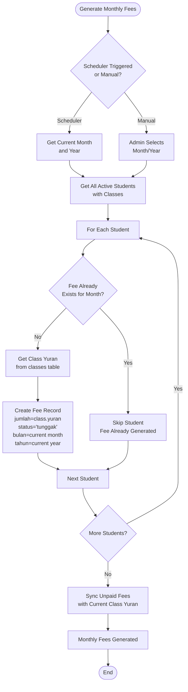
```mermaid
flowchart TD
    Start([Generate Monthly Fees]) --> CheckScheduler{Scheduler Triggered<br/>or Manual?}
    CheckScheduler -->|Scheduler| GetCurrentMonth[Get Current Month<br/>and Year]
    CheckScheduler -->|Manual| AdminSelects[Admin Selects<br/>Month/Year]
    GetCurrentMonth --> GetActiveStudents[Get All Active Students<br/>with Classes]
    AdminSelects --> GetActiveStudents
    GetActiveStudents --> ForEachStudent[For Each Student]
    ForEachStudent --> CheckExistingFee{Fee Already<br/>Exists for Month?}
    CheckExistingFee -->|Yes| SkipStudent[Skip Student<br/>Fee Already Generated]
    CheckExistingFee -->|No| GetClassYuran[Get Class Yuran<br/>from classes table]
    GetClassYuran --> CreateFee[Create Fee Record<br/>jumlah=class.yuran<br/>status='tunggak'<br/>bulan=current month<br/>tahun=current year]
    CreateFee --> NextStudent[Next Student]
    SkipStudent --> NextStudent
    NextStudent --> MoreStudents{More Students?}
    MoreStudents -->|Yes| ForEachStudent
    MoreStudents -->|No| SyncFees[Sync Unpaid Fees<br/>with Current Class Yuran]
    SyncFees --> Success[Monthly Fees Generated]
    Success --> End([End])
```

**Key Steps:**
1. System triggers monthly fee generation (scheduler or manual)
2. System gets all active students with assigned classes
3. For each student:
   - System checks if fee already exists for the month
   - If not exists: System gets class `yuran` (fee amount)
   - System creates fee record with status='tunggak' (unpaid)
4. System syncs unpaid fees with current class yuran (in case class fee changed)
5. Success response returned

**API Endpoint:** `POST /fees/generate-monthly` (Admin only)

**Scheduler:** Runs automatically on 1st of each month

**Database Tables:**
- `fees` - Fee records
- `classes` - Class yuran (fee amount)
- `students` - Student enrollment

---

### 5.2 Fee Payment Process

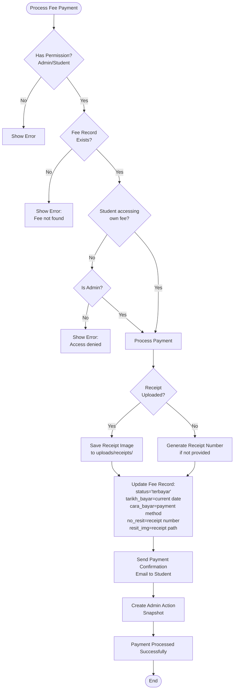
```mermaid
flowchart TD
    Start([Process Fee Payment]) --> CheckPermission{Has Permission?<br/>Admin/Student}
    CheckPermission -->|No| ShowError[Show Error]
    CheckPermission -->|Yes| ValidateFee{Fee Record<br/>Exists?}
    ValidateFee -->|No| ShowFeeError[Show Error:<br/>Fee not found]
    ValidateFee -->|Yes| CheckOwnership{Student accessing<br/>own fee?}
    CheckOwnership -->|No| CheckAdmin{Is Admin?}
    CheckAdmin -->|No| ShowOwnershipError[Show Error:<br/>Access denied]
    CheckAdmin -->|Yes| ProcessPayment
    CheckOwnership -->|Yes| ProcessPayment[Process Payment]
    ProcessPayment --> UploadReceipt{Receipt<br/>Uploaded?}
    UploadReceipt -->|Yes| SaveReceipt[Save Receipt Image<br/>to uploads/receipts/]
    UploadReceipt -->|No| GenerateReceiptNo[Generate Receipt Number<br/>if not provided]
    SaveReceipt --> UpdateFee[Update Fee Record:<br/>status='terbayar'<br/>tarikh_bayar=current date<br/>cara_bayar=payment method<br/>no_resit=receipt number<br/>resit_img=receipt path]
    GenerateReceiptNo --> UpdateFee
    UpdateFee --> SendConfirmation[Send Payment Confirmation<br/>Email to Student]
    SendConfirmation --> CreateSnapshot[Create Admin Action<br/>Snapshot]
    CreateSnapshot --> Success[Payment Processed Successfully]
    Success --> End([End])
```

**Key Steps:**
1. User (Admin or Student) initiates payment
2. System validates fee record exists
3. System checks ownership (student can only pay own fees, admin can pay any)
4. User uploads receipt (optional) or system generates receipt number
5. System saves receipt image to `uploads/receipts/` if provided
6. System updates fee record:
   - status='terbayar' (paid)
   - tarikh_bayar = current date
   - cara_bayar = payment method
   - no_resit = receipt number
   - resit_img = receipt image path
7. System sends payment confirmation email to student
8. System creates admin action snapshot
9. Success response returned

**API Endpoint:** `PUT /fees/:id` (Admin/Student)

**Database Tables:**
- `fees` - Fee payment records
- `admin_action_snapshots` - Undo tracking

**Payment Methods:**
- Tunai (Cash)
- Bank Transfer
- Online Payment

---

### 5.3 PIC Approval Workflow

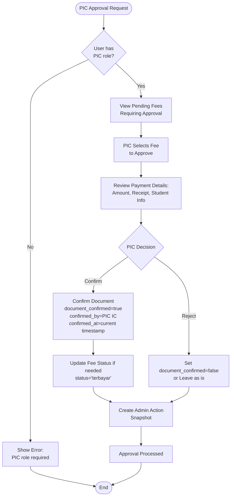
```mermaid
flowchart TD
    Start([PIC Approval Request]) --> CheckPICRole{User has<br/>PIC role?}
    CheckPICRole -->|No| ShowError[Show Error:<br/>PIC role required]
    ShowError --> End([End])
    CheckPICRole -->|Yes| ViewPendingFees[View Pending Fees<br/>Requiring Approval]
    ViewPendingFees --> SelectFee[PIC Selects Fee<br/>to Approve]
    SelectFee --> ReviewPayment[Review Payment Details:<br/>Amount, Receipt, Student Info]
    ReviewPayment --> PICDecision{PIC Decision}
    PICDecision -->|Confirm| ConfirmDocument[Confirm Document<br/>document_confirmed=true<br/>confirmed_by=PIC IC<br/>confirmed_at=current timestamp]
    PICDecision -->|Reject| SetRejected[Set document_confirmed=false<br/>or Leave as is]
    ConfirmDocument --> UpdateFeeStatus[Update Fee Status if needed<br/>status='terbayar']
    UpdateFeeStatus --> CreateSnapshot[Create Admin Action<br/>Snapshot]
    SetRejected --> CreateSnapshot
    CreateSnapshot --> Success[Approval Processed]
    Success --> End
```

**Key Steps:**
1. PIC/IB user logs in and views fees with receipts
2. PIC/IB reviews payment details (amount, receipt, student info)
3. PIC/IB confirms document via confirm-document endpoint
4. If confirmed:
   - System sets `document_confirmed=true`
   - System records confirmation (confirmed_by, confirmed_at)
   - Fee status may be updated to 'terbayar' if not already
5. System creates admin action snapshot
6. Success response returned

**API Endpoint:** `POST /fees/:id/confirm-document` (PIC/IB/Admin role)

**Note:** PIC approval is handled through document confirmation endpoint. PIC users can confirm fee documents which effectively approves the payment.

**Database Tables:**
- `fees` - Fee approval tracking (document_confirmed, confirmed_by, confirmed_at fields)
- `user_roles` - PIC role validation
- `admin_action_snapshots` - Undo tracking

---

### 5.4 Fee Document Confirmation

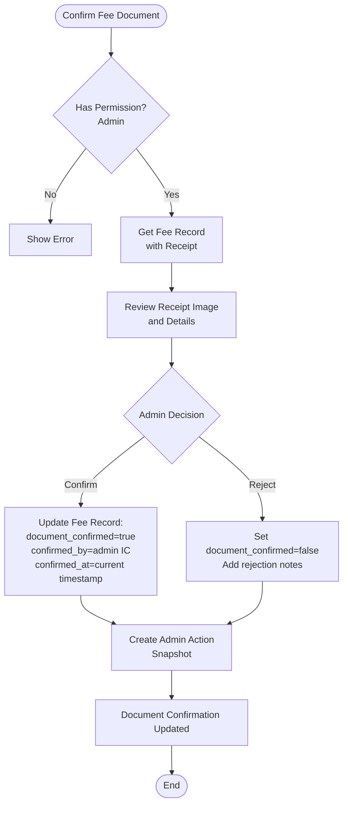
```mermaid
flowchart TD
    Start([Confirm Fee Document]) --> CheckPermission{Has Permission?<br/>Admin}
    CheckPermission -->|No| ShowError[Show Error]
    CheckPermission -->|Yes| GetFee[Get Fee Record<br/>with Receipt]
    GetFee --> ReviewReceipt[Review Receipt Image<br/>and Details]
    ReviewReceipt --> AdminDecision{Admin Decision}
    AdminDecision -->|Confirm| UpdateConfirmation[Update Fee Record:<br/>document_confirmed=true<br/>confirmed_by=admin IC<br/>confirmed_at=current timestamp]
    AdminDecision -->|Reject| SetRejected[Set document_confirmed=false<br/>Add rejection notes]
    UpdateConfirmation --> CreateSnapshot[Create Admin Action<br/>Snapshot]
    SetRejected --> CreateSnapshot
    CreateSnapshot --> Success[Document Confirmation Updated]
    Success --> End([End])
```

**Key Steps:**
1. Admin views fee with receipt document
2. Admin reviews receipt image and payment details
3. Admin confirms or rejects document
4. If confirmed:
   - System sets `document_confirmed=true`
   - System records admin confirmation (confirmed_by, confirmed_at)
5. If rejected:
   - System sets `document_confirmed=false`
   - System adds rejection notes
6. System creates admin action snapshot
7. Success response returned

**API Endpoint:** `PUT /fees/:id/confirm-document` (Admin only)

**Database Tables:**
- `fees` - Document confirmation tracking
- `admin_action_snapshots` - Undo tracking

---

## 6. Exam & Results Workflows

### 6.1 Exam Creation

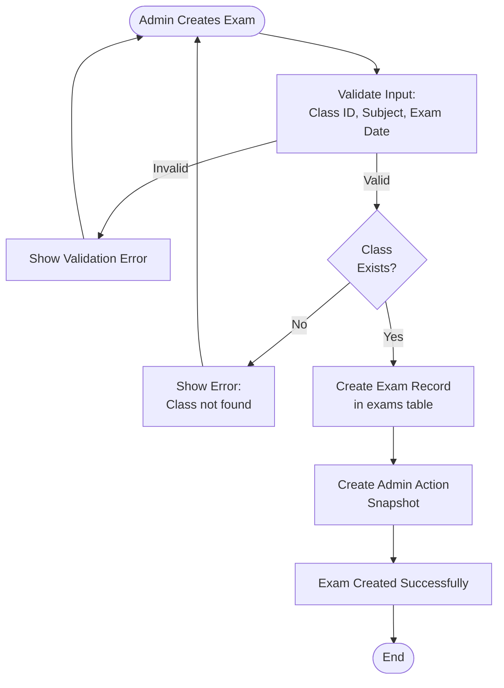
```mermaid
flowchart TD
    Start([Admin Creates Exam]) --> ValidateInput[Validate Input:<br/>Class ID, Subject, Exam Date]
    ValidateInput -->|Invalid| ShowError[Show Validation Error]
    ShowError --> Start
    ValidateInput -->|Valid| ValidateClass{Class<br/>Exists?}
    ValidateClass -->|No| ShowClassError[Show Error:<br/>Class not found]
    ShowClassError --> Start
    ValidateClass -->|Yes| CreateExam[Create Exam Record<br/>in exams table]
    CreateExam --> CreateSnapshot[Create Admin Action<br/>Snapshot]
    CreateSnapshot --> Success[Exam Created Successfully]
    Success --> End([End])
```

**Key Steps:**
1. Admin enters exam details (class ID, subject, exam date)
2. System validates all input fields
3. System validates class exists
4. System creates exam record
5. System creates admin action snapshot
6. Success response returned

**API Endpoint:** `POST /exams` (Admin only)

**Database Tables:**
- `exams` - Exam records
- `classes` - Class validation
- `admin_action_snapshots` - Undo tracking

---

### 6.2 Result Entry & Management

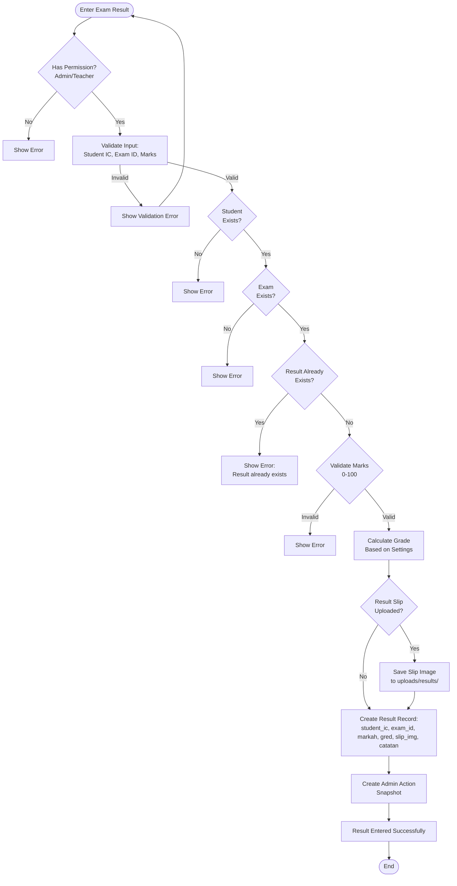
```mermaid
flowchart TD
    Start([Enter Exam Result]) --> CheckPermission{Has Permission?<br/>Admin/Teacher}
    CheckPermission -->|No| ShowError[Show Error]
    CheckPermission -->|Yes| ValidateInput[Validate Input:<br/>Student IC, Exam ID, Marks]
    ValidateInput -->|Invalid| ShowValidationError[Show Validation Error]
    ShowValidationError --> Start
    ValidateInput -->|Valid| ValidateStudent{Student<br/>Exists?}
    ValidateStudent -->|No| ShowStudentError[Show Error]
    ValidateStudent -->|Yes| ValidateExam{Exam<br/>Exists?}
    ValidateExam -->|No| ShowExamError[Show Error]
    ValidateExam -->|Yes| CheckDuplicate{Result Already<br/>Exists?}
    CheckDuplicate -->|Yes| ShowDuplicateError[Show Error:<br/>Result already exists]
    CheckDuplicate -->|No| ValidateMarks{Validate Marks<br/>0-100}
    ValidateMarks -->|Invalid| ShowMarksError[Show Error]
    ValidateMarks -->|Valid| CalculateGrade[Calculate Grade<br/>Based on Settings]
    CalculateGrade --> UploadSlip{Result Slip<br/>Uploaded?}
    UploadSlip -->|Yes| SaveSlip[Save Slip Image<br/>to uploads/results/]
    UploadSlip -->|No| CreateResult[Create Result Record:<br/>student_ic, exam_id, markah, gred, slip_img, catatan]
    SaveSlip --> CreateResult
    CreateResult --> CreateSnapshot[Create Admin Action<br/>Snapshot]
    CreateSnapshot --> Success[Result Entered Successfully]
    Success --> End([End])
```

**Key Steps:**
1. Admin/Staff enters exam result
2. System validates input (student IC, exam ID, marks)
3. System validates student exists
4. System validates exam exists
5. System checks if result already exists for student+exam
6. System validates marks (0-100)
7. System calculates grade based on grade ranges from settings
8. User optionally uploads result slip image
9. System saves slip image to `uploads/results/` if provided
10. System creates result record
11. System creates admin action snapshot
12. Success response returned

**API Endpoint:** `POST /results` (Admin/Staff)

**Note:** Teacher role is not explicitly listed in routes, but staff role includes teachers.

**Database Tables:**
- `results` - Result records
- `exams` - Exam validation
- `students` - Student validation
- `settings` - Grade range configuration
- `admin_action_snapshots` - Undo tracking

---

### 6.3 Grade Calculation

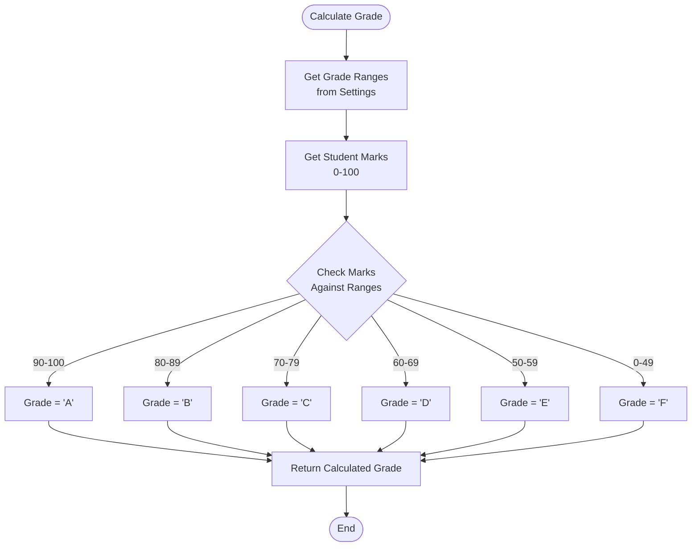
```mermaid
flowchart TD
    Start([Calculate Grade]) --> GetGradeRanges[Get Grade Ranges<br/>from Settings]
    GetGradeRanges --> GetMarks[Get Student Marks<br/>0-100]
    GetMarks --> CheckRanges{Check Marks<br/>Against Ranges}
    CheckRanges -->|90-100| GradeA[Grade = 'A']
    CheckRanges -->|80-89| GradeB[Grade = 'B']
    CheckRanges -->|70-79| GradeC[Grade = 'C']
    CheckRanges -->|60-69| GradeD[Grade = 'D']
    CheckRanges -->|50-59| GradeE[Grade = 'E']
    CheckRanges -->|0-49| GradeF[Grade = 'F']
    GradeA --> ReturnGrade[Return Calculated Grade]
    GradeB --> ReturnGrade
    GradeC --> ReturnGrade
    GradeD --> ReturnGrade
    GradeE --> ReturnGrade
    GradeF --> ReturnGrade
    ReturnGrade --> End([End])
```

**Key Steps:**
1. System retrieves grade ranges from settings table
2. System gets student marks (0-100)
3. System compares marks against grade ranges:
   - A: 90-100
   - B: 80-89
   - C: 70-79
   - D: 60-69
   - E: 50-59
   - F: 0-49
4. System assigns grade based on marks
5. System stores grade in result record

**Grade Ranges:** Configurable in settings table

**Database Tables:**
- `settings` - Grade range configuration
- `results` - Grade storage

---

## 7. Role-Specific Workflows

### 7.1 Admin Workflows

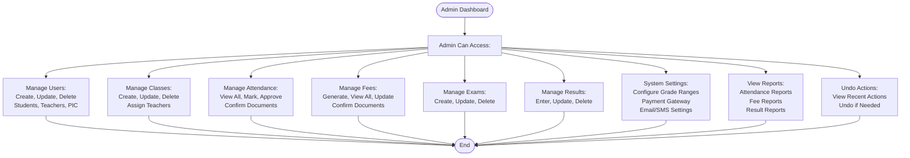
```mermaid
flowchart TD
    Start([Admin Dashboard]) --> ViewOptions[Admin Can Access:]
    ViewOptions --> ManageUsers[Manage Users:<br/>Create, Update, Delete<br/>Students, Teachers, PIC]
    ViewOptions --> ManageClasses[Manage Classes:<br/>Create, Update, Delete<br/>Assign Teachers]
    ViewOptions --> ManageAttendance[Manage Attendance:<br/>View All, Mark, Approve<br/>Confirm Documents]
    ViewOptions --> ManageFees[Manage Fees:<br/>Generate, View All, Update<br/>Confirm Documents]
    ViewOptions --> ManageExams[Manage Exams:<br/>Create, Update, Delete]
    ViewOptions --> ManageResults[Manage Results:<br/>Enter, Update, Delete]
    ViewOptions --> SystemSettings[System Settings:<br/>Configure Grade Ranges<br/>Payment Gateway<br/>Email/SMS Settings]
    ViewOptions --> ViewReports[View Reports:<br/>Attendance Reports<br/>Fee Reports<br/>Result Reports]
    ViewOptions --> UndoActions[Undo Actions:<br/>View Recent Actions<br/>Undo if Needed]
    ManageUsers --> End([End])
    ManageClasses --> End
    ManageAttendance --> End
    ManageFees --> End
    ManageExams --> End
    ManageResults --> End
    SystemSettings --> End
    ViewReports --> End
    UndoActions --> End
```

**Admin Capabilities:**
- Full CRUD operations on all entities
- System configuration and settings
- View all data (no restrictions)
- Generate reports
- Undo recent actions (within TTL window)
- Approve/reject documents
- Manage user roles and permissions

**API Endpoints:** All endpoints with `requireRole(['admin'])` middleware

---

### 7.2 Teacher Workflows

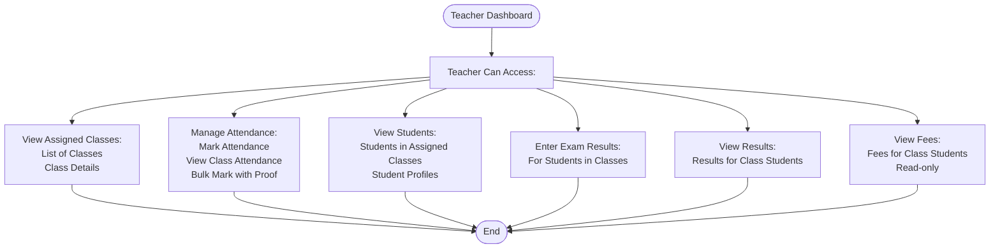
```mermaid
flowchart TD
    Start([Teacher Dashboard]) --> ViewOptions[Teacher Can Access:]
    ViewOptions --> ViewClasses[View Assigned Classes:<br/>List of Classes<br/>Class Details]
    ViewOptions --> ManageAttendance[Manage Attendance:<br/>Mark Attendance<br/>View Class Attendance<br/>Bulk Mark with Proof]
    ViewOptions --> ViewStudents[View Students:<br/>Students in Assigned Classes<br/>Student Profiles]
    ViewOptions --> EnterResults[Enter Exam Results:<br/>For Students in Classes]
    ViewOptions --> ViewResults[View Results:<br/>Results for Class Students]
    ViewOptions --> ViewFees[View Fees:<br/>Fees for Class Students<br/>Read-only]
    ViewClasses --> End([End])
    ManageAttendance --> End
    ViewStudents --> End
    EnterResults --> End
    ViewResults --> End
    ViewFees --> End
```

**Teacher Capabilities:**
- View and manage assigned classes only
- Mark attendance for their classes
   - Enter exam results for their students (if staff role includes teachers)
- View student profiles (in their classes)
- View fees (read-only, for their students)
- Cannot create/delete classes
- Cannot manage users
- Cannot access system settings

**API Endpoints:** Endpoints with role-based filtering (teacher can only access their classes)

---

### 7.3 Student Workflows

```mermaid
flowchart TD
    Start([Student Dashboard]) --> ViewOptions[Student Can Access:]
    ViewOptions --> ViewProfile[View Own Profile:<br/>Personal Information<br/>Class Assignment]
    ViewOptions --> UpdateProfile[Update Own Profile:<br/>Email, Phone, Address<br/>Cannot change IC/Name]
    ViewOptions --> ViewAttendance[View Own Attendance:<br/>Attendance History<br/>Attendance Statistics]
    ViewOptions --> ViewFees[View Own Fees:<br/>Fee History<br/>Payment Status<br/>Pay Fees]
    ViewOptions --> ViewResults[View Own Results:<br/>Exam Results<br/>Grades]
    ViewOptions --> ViewAnnouncements[View Announcements:<br/>Targeted to Students]
    ViewProfile --> End([End])
    UpdateProfile --> End
    ViewAttendance --> End
    ViewFees --> End
    ViewResults --> End
    ViewAnnouncements --> End
```

**Student Capabilities:**
- View own profile and information
- Update own profile (limited fields)
- View own attendance history
- View own fees and make payments
- View own exam results
- View announcements
- Cannot access other students' data
- Cannot mark attendance
- Cannot enter results
- Cannot manage classes

**API Endpoints:** Endpoints with ownership filtering (student can only access own data)

---

### 7.4 IB (Payment Approver) Workflows

```mermaid
flowchart TD
    Start([IB/PIC Dashboard]) --> ViewOptions[IB Can Access:]
    ViewOptions --> ViewPendingFees[View Pending Fees:<br/>Fees Requiring Approval<br/>With Receipt Documents]
    ViewOptions --> ApproveFees[Approve Fees:<br/>Review Receipt<br/>Approve Payment]
    ViewOptions --> RejectFees[Reject Fees:<br/>If Receipt Invalid<br/>Add Rejection Notes]
    ViewOptions --> ViewFeeHistory[View Fee History:<br/>All Approved/Rejected Fees]
    ViewPendingFees --> End([End])
    ApproveFees --> End
    RejectFees --> End
    ViewFeeHistory --> End
```

**IB/PIC Capabilities:**
- View pending fees requiring approval
- Review payment receipts
- Approve or reject fee payments
- View fee approval history
- Cannot create/update fees
- Cannot manage students/classes
- Cannot access attendance/results

**API Endpoints:**
- `GET /fees` - View fees (can filter by status)
- `POST /fees/:id/confirm-document` - Confirm fee document (approves payment)
- `GET /fees/:id` - View specific fee details

**Database Tables:**
- `fees` - Fee approval tracking
- `user_roles` - PIC role validation

---

## 8. System-Level Workflows

### 8.1 Yearly Database Migration

```mermaid
flowchart TD
    Start([Yearly Migration Process]) --> AdminInitiates[Admin Initiates<br/>New Year Migration]
    AdminInitiates --> BackupCurrentDB[Backup Current Year<br/>Database]
    BackupCurrentDB --> CreateNewDB[Create New Year Database<br/>masjid_app_YYYY]
    CreateNewDB --> RunSchema[Run Database Schema<br/>Create All Tables]
    RunSchema --> TransferData[Transfer Data from<br/>Old Year to New Year]
    TransferData --> CopyStudents[Copy Students Table<br/>All Student Records]
    TransferData --> CopyTeachers[Copy Teachers Table<br/>All Teacher Records]
    TransferData --> CopyClasses[Copy Classes Table<br/>All Class Records]
    CopyStudents --> ResetTransactional[Reset Transactional Data:<br/>Clear Fees, Attendance, Results]
    CopyTeachers --> ResetTransactional
    CopyClasses --> ResetTransactional
    ResetTransactional --> UpdateMasterDB[Update Master Database<br/>Set New Year as Active]
    UpdateMasterDB --> VerifyMigration[Verify Migration<br/>Check Data Integrity]
    VerifyMigration --> Success{Migration<br/>Successful?}
    Success -->|Yes| ActivateNewYear[Activate New Year<br/>Update Application Config]
    Success -->|No| Rollback[Rollback Migration<br/>Restore from Backup]
    ActivateNewYear --> End([End])
    Rollback --> End
```

**Key Steps:**
1. Admin initiates yearly migration process
2. System backs up current year database
3. System creates new year database: `masjid_app_YYYY`
4. System runs database schema to create all tables
5. System transfers persistent data:
   - Students table (all records)
   - Teachers table (all records)
   - Classes table (all records)
6. System resets transactional data:
   - Fees table (cleared)
   - Attendance table (cleared)
   - Results table (cleared)
   - Exams table (cleared)
7. System updates master database to set new year as active
8. System verifies migration (data integrity checks)
9. If successful: System activates new year
10. If failed: System rolls back from backup

**API Endpoint:** `POST /migration/migrate-year` (Admin only)

**Database Structure:**
- Master DB: `masjid_master` - Tracks active years
- Year DBs: `masjid_app_2024`, `masjid_app_2025`, etc.

**Benefits:**
- Clean yearly separation
- Easy backup and restore
- Historical data preservation
- Simplified queries (no year filtering needed)

---

### 8.2 Admin Actions & Snapshots

```mermaid
flowchart TD
    Start([Admin Performs Action]) --> ActionType{Action Type}
    ActionType -->|Create| CreateEntity[Create Entity<br/>Student/Class/Teacher/etc]
    ActionType -->|Update| UpdateEntity[Update Entity]
    ActionType -->|Delete| DeleteEntity[Delete Entity]
    CreateEntity --> CaptureSnapshot[Capture Snapshot:<br/>Operation, Entity Type,<br/>Entity ID, Data, Actor IC]
    UpdateEntity --> CaptureSnapshot
    DeleteEntity --> CaptureSnapshot
    CaptureSnapshot --> StoreSnapshot[Store Snapshot in<br/>admin_action_snapshots table]
    StoreSnapshot --> SetExpiry[Set Expiry Time<br/>TTL: 24 hours]
    SetExpiry --> ContinueAction[Continue with Action]
    ContinueAction --> Success[Action Completed]
    Success --> AdminViewsUndo[Admin Views Undoable Actions<br/>Within TTL Window]
    AdminViewsUndo --> SelectUndo{Select Action<br/>to Undo?}
    SelectUndo -->|Yes| ValidateUndo{Validate Undo:<br/>Not Already Undone<br/>Not Expired}
    ValidateUndo -->|Invalid| ShowUndoError[Show Error:<br/>Cannot Undo]
    ValidateUndo -->|Valid| ExecuteUndo[Execute Undo Handler<br/>Based on Entity Type]
    ExecuteUndo --> RestoreData[Restore/Reverse Data<br/>Based on Operation]
    RestoreData --> MarkUndone[Mark Snapshot<br/>was_undone=true]
    MarkUndone --> UndoSuccess[Undo Successful]
    SelectUndo -->|No| End([End])
    ShowUndoError --> End
    UndoSuccess --> End
```

**Key Steps:**
1. Admin performs action (create/update/delete) on entity
2. System captures snapshot before action:
   - Operation type (create/update/delete)
   - Entity type (student/class/teacher/etc)
   - Entity ID/identifier
   - Full data snapshot (before state for update/delete, after state for create)
   - Actor IC (admin who performed action)
3. System stores snapshot in `admin_action_snapshots` table
4. System sets expiry time (TTL: 24 hours default)
5. System continues with original action
6. Admin can view undoable actions (within TTL window)
7. Admin selects action to undo
8. System validates undo (not already undone, not expired)
9. System executes entity-specific undo handler
10. System restores/reverses data based on operation:
    - Create → Delete
    - Update → Restore previous state
    - Delete → Restore entity
11. System marks snapshot as undone
12. Undo successful

**Supported Entity Types:**
- Student
- Teacher
- Class
- Attendance
- Fee
- Exam
- Result
- Announcement
- PIC User

**API Endpoints:**
- `GET /admin-actions` - List undoable actions
- `POST /admin-actions/:id/undo` - Undo action

**Database Tables:**
- `admin_action_snapshots` - Snapshot storage
- All entity tables (for undo operations)

**Snapshot TTL:** 24 hours (configurable via `SNAPSHOT_TTL_HOURS`)

---

## Related API Endpoints

### Authentication
- `POST /auth/register` - Student self-registration
- `POST /auth/login` - User login
- `POST /auth/check-reset-options` - Check password reset options
- `POST /auth/request-reset-email` - Request email password reset
- `POST /auth/request-reset-phone` - Request phone password reset
- `POST /auth/reset-password` - Reset password with token/code

### Students
- `GET /students` - List students
- `GET /students/:ic` - Get student by IC
- `POST /students` - Create student (Admin)
- `PUT /students/:ic` - Update student
- `DELETE /students/:ic` - Delete student (Admin)

### Classes
- `GET /classes` - List classes
- `GET /classes/:id` - Get class by ID
- `POST /classes` - Create class (Admin)
- `PUT /classes/:id` - Update class (Admin)
- `DELETE /classes/:id` - Delete class (Admin)

### Attendance
- `GET /attendance` - List attendance records
- `POST /attendance` - Mark individual attendance
- `POST /attendance/bulk` - Mark bulk attendance
- `POST /attendance/bulk-with-proof` - Mark attendance with proof
- `PUT /attendance/:id/confirm-document` - Confirm document (Admin)
- `DELETE /attendance/:id` - Delete attendance (Admin)

### Fees
- `GET /fees` - List fees
- `GET /fees/:id` - Get fee by ID
- `POST /fees` - Create fee (Admin)
- `POST /fees/generate-monthly` - Generate monthly fees (Admin)
- `PUT /fees/:id` - Update fee (payment)
- `POST /fees/:id/confirm-document` - Confirm fee document (PIC/IB/Admin)
- `PUT /fees/:id/confirm-document` - Confirm document (Admin)
- `DELETE /fees/:id` - Delete fee (Admin)

### Exams
- `GET /exams` - List exams
- `GET /exams/:id` - Get exam by ID
- `POST /exams` - Create exam (Admin)
- `PUT /exams/:id` - Update exam (Admin)
- `DELETE /exams/:id` - Delete exam (Admin)

### Results
- `GET /results` - List results
- `GET /results/:id` - Get result by ID
- `POST /results` - Create result (Admin/Staff)
- `PUT /results/:id` - Update result (Admin/Staff)
- `DELETE /results/:id` - Delete result (Admin)

### Admin Actions
- `GET /admin-actions` - List undoable actions
- `POST /admin-actions/:id/undo` - Undo action

### Migration
- `POST /migration/migrate-year` - Migrate to new year (Admin)

---

## Database Schema Overview

### Core Tables
- `users` - All users (students, teachers, admins, PIC)
- `students` - Student-specific data (class assignment)
- `teachers` - Teacher-specific data (expertise)
- `classes` - Class information (schedule, fee, teacher)
- `user_roles` - User role assignments (RBAC)

### Transactional Tables
- `attendance` - Attendance records
- `fees` - Fee records and payments
- `exams` - Exam records
- `results` - Exam result records

### System Tables
- `admin_action_snapshots` - Undo tracking
- `password_reset_tokens` - Password reset tokens/codes
- `login_attempts` - Failed login tracking
- `settings` - System configuration

---

## Security Features

1. **Authentication & Authorization**
   - JWT-based authentication
   - Role-based access control (RBAC)
   - Account lockout after failed attempts
   - Password hashing (bcrypt, 12 rounds)

2. **Password Recovery**
   - Two methods: Email (24h) and SMS (10min)
   - One-time use tokens/codes
   - User enumeration prevention

3. **Data Protection**
   - Input validation and sanitization
   - SQL injection prevention (parameterized queries)
   - File upload validation
   - Role-based data filtering

4. **Audit Trail**
   - Admin action snapshots
   - Undo functionality (24h TTL)
   - Login attempt tracking

---

## Notes

- All workflows support error handling and validation
- Admin actions can be undone within 24 hours
- Role-based access control enforced at API level
- Yearly database migration preserves historical data
- File uploads stored in `uploads/` directory with subdirectories
- Email/SMS services optional (graceful degradation in development)

---

*Last Updated: 2025*

