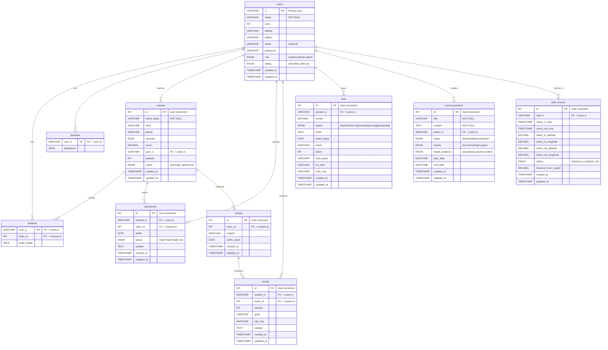

# Entity Relationship Diagram (ERD) - MyMasjidApp Database

## Database Schema Overview

This document contains the Entity Relationship Diagram for the MyMasjidApp database.

## ERD Diagram

## Table Relationships

### Core Relationships

1. **users** (Master Table)
   - One-to-One with **students** (via `user_ic`)
   - One-to-One with **teachers** (via `user_ic`)
   - One-to-Many with **classes** (as teacher via `guru_ic`)
   - One-to-Many with **attendance** (as student via `student_ic`)
   - One-to-Many with **results** (via `student_ic`)
   - One-to-Many with **fees** (via `student_ic`)
   - One-to-Many with **announcements** (via `author_ic`)
   - One-to-Many with **staff_checkin** (via `staff_ic`)

2. **classes**
   - One-to-Many with **students** (via `kelas_id`)
   - One-to-Many with **attendance** (via `class_id`)
   - One-to-Many with **exams** (via `class_id`)

3. **exams**
   - One-to-Many with **results** (via `exam_id`)

## Key Constraints

- **Primary Keys**: Each table has a primary key (PK)
- **Foreign Keys**: Relationships are enforced via foreign key constraints
- **Cascade Deletes**: Most relationships use `ON DELETE CASCADE` to maintain referential integrity
- **Set Null**: Some relationships use `ON DELETE SET NULL` (e.g., students.kelas_id, classes.guru_ic)

## Notes

- The `users` table is the central entity that all other tables reference
- Students and Teachers are specializations of Users (inheritance pattern)
- All timestamps are automatically managed with `created_at` and `updated_at` columns
- The database uses MySQL/MariaDB with InnoDB engine for transaction support
