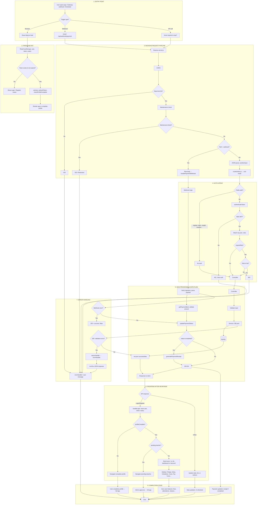

# MyMasjidApp — End-to-End System Workflow

Workflow derived from the current codebase: entry point, main processes, decision points, component interactions, data flow, error handling, and completion state.

---

## 1. Step-by-Step Numbered Flow

### Entry point (user or system)

1. **User / system trigger** — User opens app (React, `index.html` → `App.jsx`) or payment gateway sends `POST /api/webhook/payment`. Alternative: scheduled jobs (server startup in `server.js`: `scheduleAnnualDatabaseBackup`, `scheduleMonthlyFeeGeneration`, etc.).

2. **Frontend initial load** — `App.jsx` runs; reads `localStorage` (`user`, `authToken`, `authTokenExpiry`). If no token or expiry past → clear auth, show login routes. If token present and not expired → set user state, `setAuthToken(token)`, call `authAPI.checkProfileComplete()`.

3. **Backend request receipt** — Request hits Express (`server.js`). Order: CORS (`corsOptions`), rate limit (`generalLimiter` on `/api`), then either webhook path or JSON/urlencoded body + `sanitizeInput`, then `checkMaintenanceMode`.

4. **Maintenance decision** — `middleware/maintenanceMode.js`: if `modeType !== NONE` and path not whitelisted (`/health`, `/api/auth/login`, `/api/maintenance/status`, `/api/admin/maintenance`) and user not allowed → block (503/restricted). Else → continue.

5. **Webhook branch** — If path is `POST /api/webhook/payment`: raw body parsed to JSON, `handlePaymentWebhook` (no auth). Else → `app.use('/api', routes)` → `routes/index.js` dispatches to sub-router.

6. **API route dispatch** — `routes/index.js`: request matched to one of auth, students, teachers, classes, attendance, exams, fees, payments, toyyibpay, receipts, etc. Sub-router runs its handlers (and middlewares).

7. **Auth decision (protected routes)** — `middleware/auth.js`: paths containing `register` (POST), or `req.skipAuth` / masjid-location / teacher-register flag → skip auth (`next()`). Else: read `Authorization: Bearer <token>`, verify JWT, load user from DB, `fetchUserRoles` → attach `user` + `roles` to `req`; on failure → 401.

8. **Role check** — Routes using `requireRole(['admin'])` etc.: if `getEffectiveRole(req.user)` not in list → 403. Else → controller runs.

9. **Controller execution** — Controller (e.g. `authController.login`, `toyyibPayController.initiate`, `attendanceController.markAttendance`) runs. Validates input (express-validator where used), calls services, uses `pool` (`config/database.js`) for DB.

10. **Data flow (typical)** — Input: `req.body` / `req.params` / `req.user`. Processing: service layer (e.g. `paymentService`, `toyyibpayService`, `attendanceService`) + SQL via `pool`. Output: `res.status(...).json({ success, message, data })`. Frontend receives response; axios interceptor returns `response.data`.

11. **Frontend post-auth flow** — After login/register, `handleLogin(userData)` stores user/token/expiry in localStorage, runs `checkProfileComplete()`. If `profileComplete === false` → only route is `/complete-profile` until complete. If `user.status === 'pending'` and role teacher → only `/pending-teacher` and `/pending-teacher/documents`. Else → main app: role-based default (admin/teacher/pic/staff → `/`, ib → `/ib-dashboard`, student → `/account`), sidebar (Pelajar, Kelas, Kehadiran, Yuran, Pay Yuran, etc.).

12. **Optional auto check-in** — If `sessionStorage.autoCheckInPending` and user is staff/teacher/admin/pic: get GPS, call `staffCheckInAPI.autoCheckIn()`; toast result (success / outside_location / already_checked_in / timeout).

13. **Main process examples** — **Registration:** `POST /auth/register` or `POST /teachers/register` → validation (IC 12 digits, nama, etc.) → insert user/student or user (pending) → response + JWT or redirect. **Pay Yuran:** User on `/pay-yuran/:id` → `feesAPI.getById(id)`, settings; Pay via ToyyibPay → `api.post('/toyyibpay/initiate', { amount, description, feeId })` → backend creates bill, returns `paymentUrl` → redirect; gateway later calls webhook. **Attendance:** Kehadiran page → `POST /attendance` or bulk with class_id, tarikh, student_ic, status → controller → DB. **Classes/Students:** CRUD via `/classes`, `/students`; admin class change via `/admin/classes/change`.

14. **Webhook processing** — `webhookController.handlePaymentWebhook`: require `provider`; get gateway config; verify signature; parse payload (paymentId, status, amount, etc.); `getPaymentById(paymentId)`; validate amount match; map status to completed/failed/processing; `updatePaymentStatus()`; if completed, `generatePaymentReceipt()`. Response: always `res.status(200).json(...)` (avoid gateway retries).

15. **Error handling (backend)** — `middleware/errorHandler.js`: if `res.headersSent` → `next(err)`. Else: `ER_DUP_ENTRY` → 409; `ER_NO_REFERENCED_ROW_2` → 400; `ER_BAD_FIELD_ERROR` → 500; `ValidationError` → 400; JWT error → 401; else `err.statusCode` or 500. Async routes use `asyncHandler(fn)` so rejections go to errorHandler.

16. **Error handling (frontend)** — `src/services/api.js` response interceptor: 401 → clear auth, reject with session message; 429 → rate limit message; no `error.response` (network/timeout) → user message; else message from `error.response.data` or generic. Pages use `useErrorHandler` / toast / `ErrorDisplay`.

17. **404 and final response** — Unmatched `/api` path → 404 middleware → `next(err)` → errorHandler. Matched route → controller sends final `res.status(...).json(...)` → client receives JSON; frontend updates state (e.g. list, redirect, receipt modal).

### Final output / completion state

18. **Completion states** — **Login/register:** User in localStorage, token set, profile complete (or on complete-profile), role-based home rendered. **Payment:** Payment record updated (webhook), receipt generated if completed; user sees Payment History / Receipt. **Attendance:** Kehadiran row(s) written; stats/history reflect new data. **CRUD:** Resource created/updated/deleted; list or detail view refreshed. **Errors:** User sees toast or inline message; backend logs error; 4xx/5xx returned; no state change or partial rollback per current code.

---

## 2. Mermaid Flowchart (End-to-End)

Single diagram: entry → decisions → components → data flow → errors → completion.

---

## 3. Component / Module Interactions

| From | To | Interaction |
|------|-----|-------------|
| Browser | Express | HTTP to `/api/*` or static; Axios with `Authorization: Bearer` |
| App.jsx | authAPI, feesAPI, etc. | `api.get/post/put/delete` from `services/api.js` |
| api.js | Backend | baseURL from `apiBaseUrl.js`; request interceptor adds token, checks expiry; response interceptor returns `response.data`, 401→clearAuth |
| server.js | routes/index.js | `app.use('/api', routes)` |
| routes/index.js | auth.js, classes.js, attendance.js, fees.js, toyyibpay.js, etc. | Mount under `/api` |
| auth.js (middleware) | authController, userRoleService | authenticateToken → req.user; requireRole guards |
| Controllers | Services, pool | e.g. paymentController → paymentService, toyyibpayService; attendanceController → pool/attendanceService |
| Services | database.js (pool) | `pool.execute`, `pool.query` |
| Webhook | webhookController | paymentGatewayService (verify, parse), paymentService (getById, updatePaymentStatus), receiptService (generatePaymentReceipt) |
| Schedulers | DB, external | Run on server start; fee generation, backup, reconciliation, etc. |

---

## 4. Data Flow Summary

- **Input:** User form / navigation (frontend) → `req.body`, `req.params`, `req.user` (backend). Webhook: raw body → parsed JSON.
- **Processing:** express-validator (where used) → controller → service → `pool` (MySQL). External: ToyyibPay API (create bill), gateway callback.
- **Output:** `res.status(...).json({ success, message, data })` → frontend state update, redirect, or receipt modal. Webhook: `res.status(200).json(...)` always.

---

## 5. Error and Edge Cases

- **Token expired on load:** Frontend clears auth, shows login (App.jsx useEffect).
- **Invalid/missing JWT:** 401 from backend; interceptor clears auth.
- **Wrong role:** 403 from requireRole.
- **Validation failure:** 400 + errors array from backend; frontend shows field errors or toast.
- **ER_DUP_ENTRY:** 409 “Data already exists”.
- **Webhook signature invalid:** 401 from webhook; gateway may retry.
- **Webhook payment not found / amount mismatch:** 404/400; webhook still returns 200 to avoid retry storm.
- **Network/timeout:** Frontend interceptor rejects with user message (e.g. timeout).
- **429:** Rate limit message; no auth clear.
- **Maintenance:** Non-whitelisted paths blocked or restricted; admins can use whitelist.

---

*All steps and nodes are based on the current MyMasjidApp codebase (server.js, App.jsx, routes, middleware, controllers, services, api.js).*
