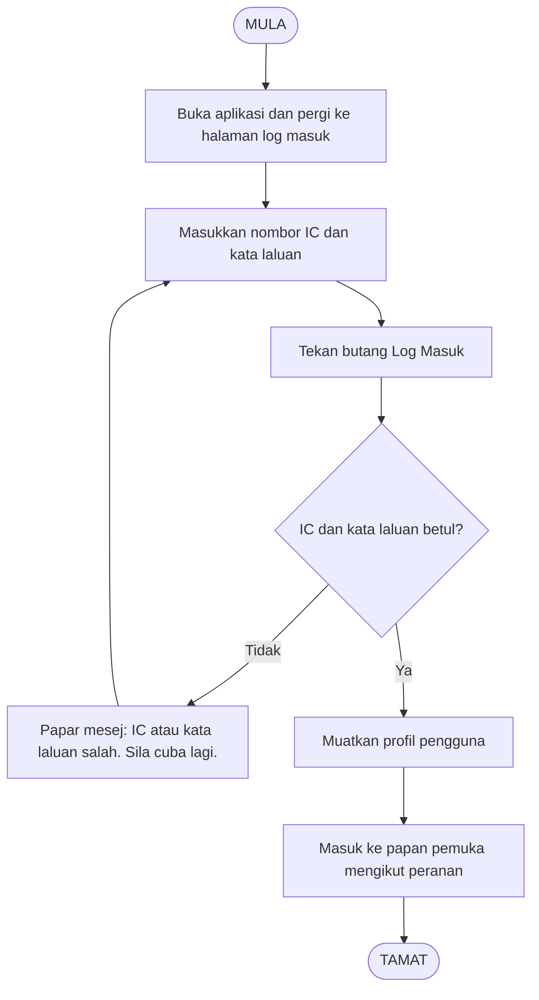
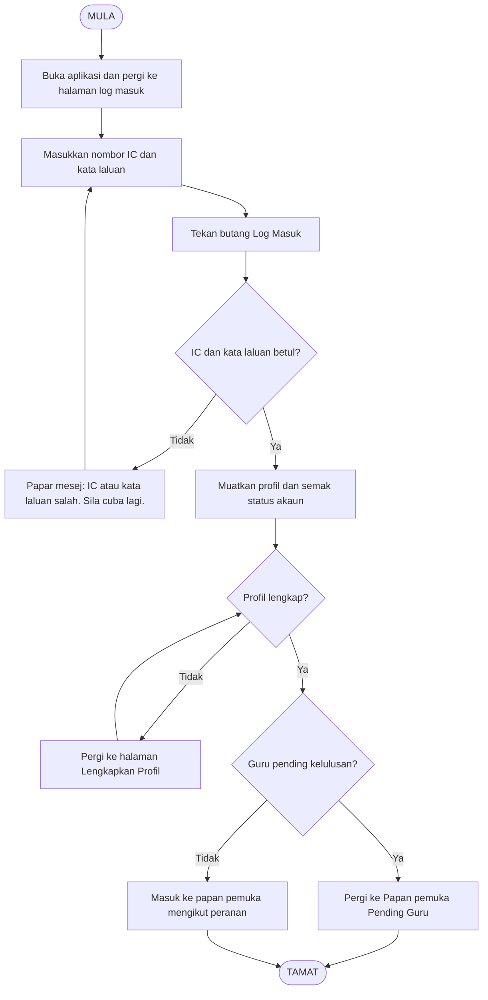

# Carta Aliran Kerja — Log Masuk MyMasjidApp

Workflow ini berdasarkan aliran log masuk sebenar dalam projek (Login.jsx, authController, App.jsx). Struktur: MULA → tindakan → keputusan → ralat/berjaya → TAMAT.

---

## 1. Step-by-Step Workflow Explanation

1. **MULA (START)**  
   Pengguna memulakan proses log masuk ke sistem MyMasjidApp.

2. **Buka aplikasi dan pergi ke halaman log masuk**  
   Pengguna membuka aplikasi (React); jika tiada token sah, App.jsx memaparkan route log masuk. Pengguna memilih tab "Log Masuk" (bukan Student Login / Check-in).

3. **Masukkan nombor IC dan kata laluan**  
   Pengguna mengisi medan IC (format 12 digit) dan kata laluan dalam borang di `Login.jsx` (formData.icNumber, formData.password).

4. **Tekan butang "Log Masuk"**  
   Pengguna menghantar borang; frontend memanggil `api.post('/auth/login', { icNumber, password })`. Backend menerima di `authController.login`; normalize IC, cari pengguna, semak kata laluan dengan bcrypt.

5. **Keputusan: IC dan kata laluan betul?**  
   - **Tidak:** Backend mengembalikan 401/403 dengan mesej (contoh: "IC Number atau kata laluan salah", akaun dikunci, pending, tidak aktif, atau "Pelajar mesti menggunakan Student Login"). Frontend menetapkan `setError(errorMessage)` dan `showMessage(..., 'error')`; pengguna melihat mesej ralat dan boleh mencuba semula (kembali ke langkah 3).
   - **Ya:** Backend mengembalikan token JWT dan objek user; frontend menyimpan token, user dan expiry dalam localStorage, memanggil `onLogin(persistedUser)`.

6. **Muatkan profil pengguna**  
   App.jsx menjalankan `checkProfileComplete()`; jika profil tidak lengkap, pengguna dialihkan ke `/complete-profile` sehingga selesai. Jika status pengguna ialah guru "pending", pengguna hanya boleh akses `/pending-teacher` sehingga diluluskan.

7. **Masuk ke papan pemuka mengikut peranan**  
   Setelah profil lengkap dan bukan pending (atau pending teacher dibenarkan), pengguna masuk ke halaman utama mengikut peranan: Pentadbir/Staff/Guru → `/` (Dashboard), IB → `/ib-dashboard`, Pelajar → `/account`. Layout memaparkan sidebar (Pelajar, Kelas, Kehadiran, Yuran, dll.).

8. **TAMAT (END)**  
   Log masuk berjaya; pengguna berada dalam aplikasi dan boleh menggunakan fungsi mengikut peranan.

---

## 2. Mermaid Flowchart (Carta Aliran)

Struktur sama seperti carta aliran asas: MULA → langkah berurutan → satu keputusan (Ya/Tidak) → ralat + gelung semula atau laluan berjaya → TAMAT.

---

## 3. Versi dengan dua keputusan (Profil lengkap & Pending)

Jika anda mahu carta yang menyatakan semakan "Profil lengkap?" dan "Guru pending?", gunakan versi di bawah.

---

## 4. Rujukan Kod (Ringkas)

- **Frontend:** `src/App.jsx` (auth state, profile complete, pending teacher, route redirect); `src/components/auth/Login.jsx` (form, submit, error message, onLogin, navigate by role).
- **Backend:** `backend/routes/auth.js` (POST /login, validation, normalizeIC); `backend/controllers/authController.js` (login: find user, bcrypt.compare, lockout, status checks, JWT response).
- **Mesej ralat:** Login.jsx menggunakan `err.message` atau `err.response?.data?.message` atau default "IC Number atau kata laluan salah."; backend mengembalikan mesej untuk akaun dikunci, pending, tidak aktif, dan pelajar (guna Student Login).

---

*Workflow ini berdasarkan ciri dan logik semasa projek MyMasjidApp.*
