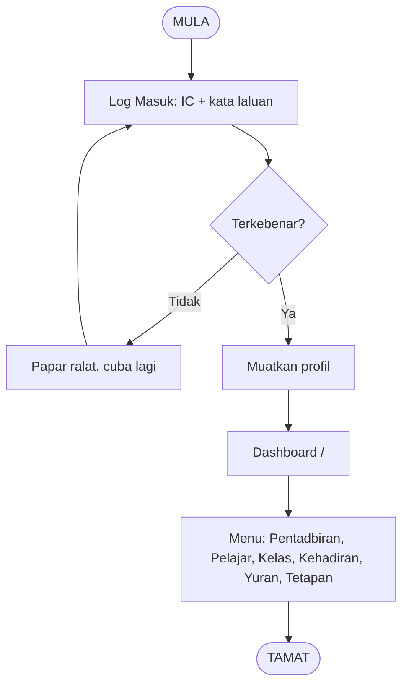
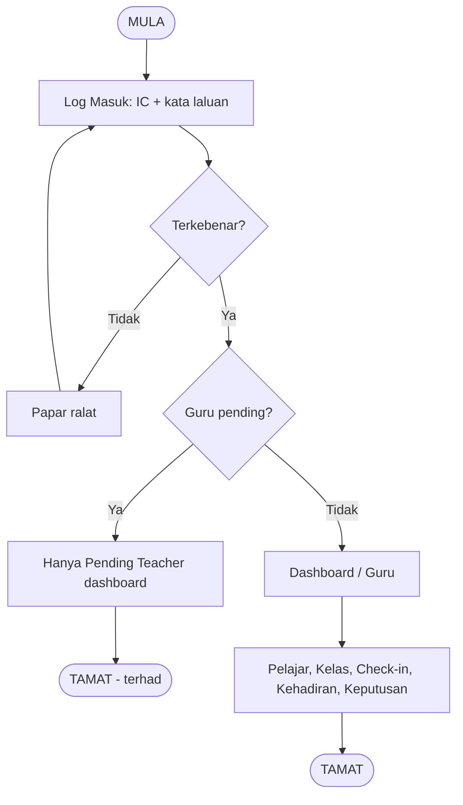
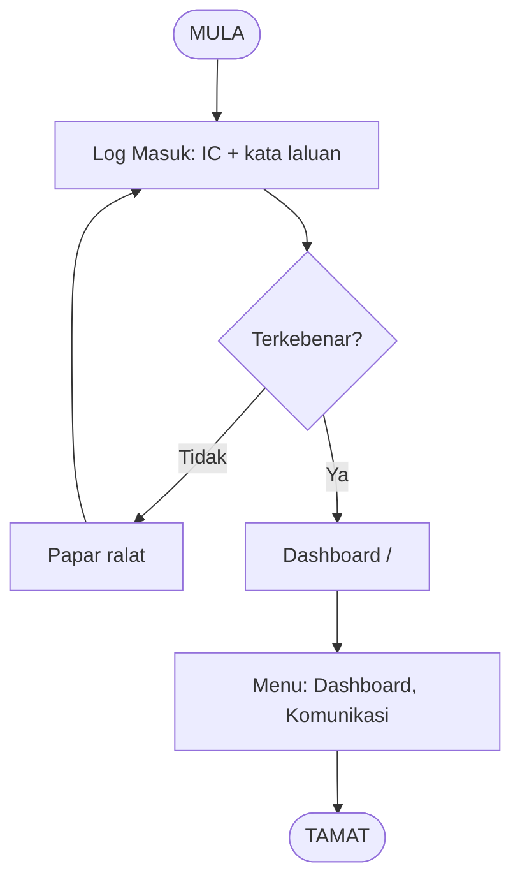
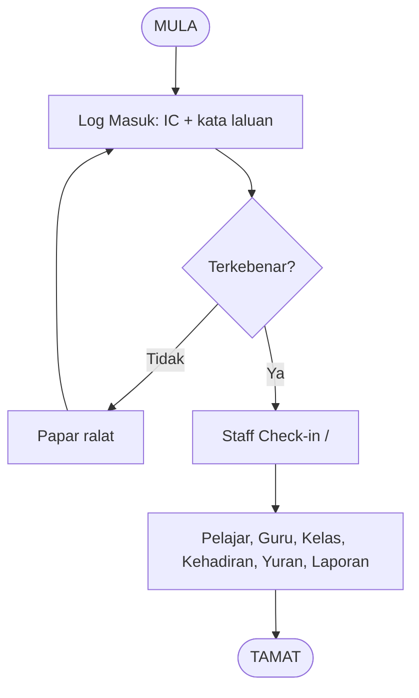
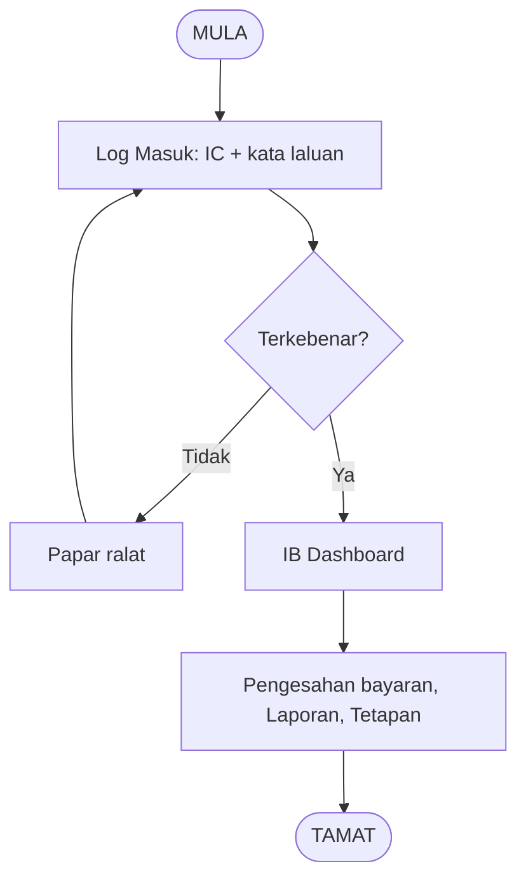
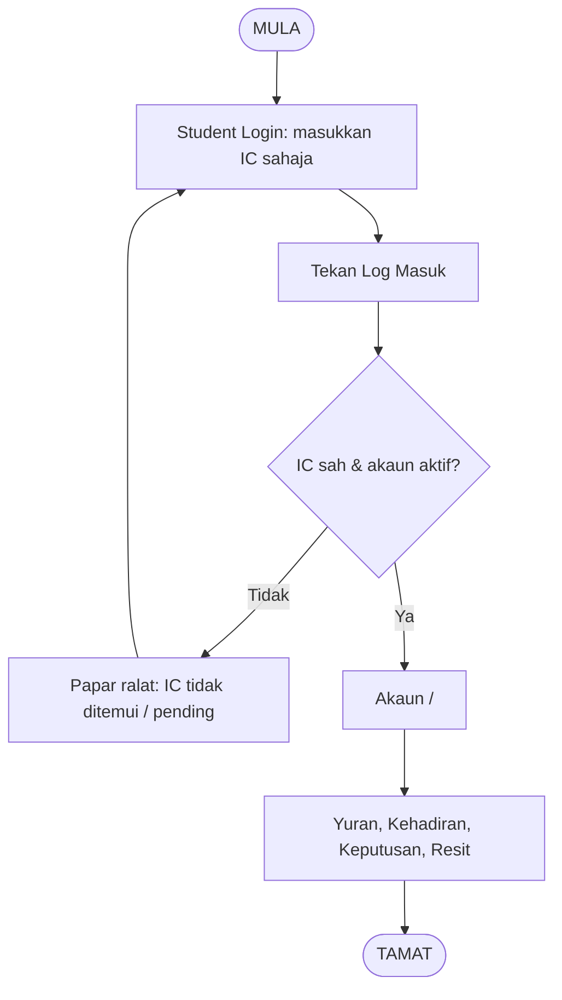
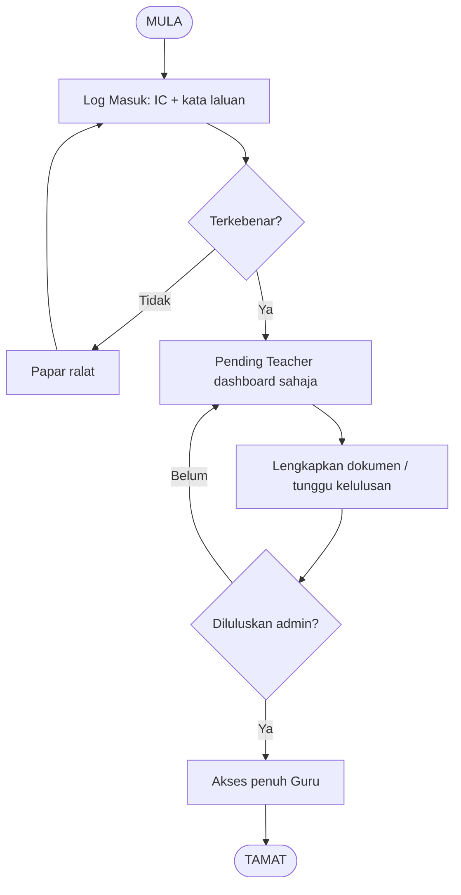

# MyMasjidApp — Workflows by User Type

Workflows for each user type, based on `Layout.jsx`, `App.jsx`, `Login.jsx`, and backend auth/role logic.

**Master template:** All flows follow the standard workflow guide: **Open app → Log in → Have account already? → (Yes) Enter credentials → Correct? → Enter homepage**, or **(No) Enter registration information → Registered?**, or **Forgot password → Reset password**. See **[WORKFLOW_GUIDE.md](./WORKFLOW_GUIDE.md)** and **workflow-guide.html** for the visual template.

---

## User Types (Roles)

| Role | Login method | Default landing | Description |
|------|--------------|----------------|-------------|
| **Admin** | IC + password (Log Masuk tab) | `/` (Dashboard) | Full system access: users, classes, attendance, fees, settings, audit. |
| **Teacher** | IC + password | `/` or `/guru` | Pelajar, Kelas, Check-in, Kehadiran, Keputusan. Pending teachers land on `/pending-teacher` until approved. |
| **Staff** | IC + password | `/` (Dashboard) | Dashboard + Communication (staff has minimal sidebar in current Layout). |
| **PIC** | IC + password | `/staff-checkin` | Pelajar, Guru, Kelas, Check-in, Kehadiran, Yuran, Keputusan, Laporan, Pending Registrations. |
| **IB** | IC + password | `/ib-dashboard` | IB Account, IB Dashboard (payment confirmation), Laporan, Settings. |
| **Student** | IC only (Student Login tab) or IC + password | `/account` | Account, Kehadiran, Yuran, Keputusan, Resit. |
| **Pending Teacher** | IC + password | `/pending-teacher` | Only Pending Teacher dashboard and Documents until admin approves. |

---

## 1. Admin Workflow

**Entry:** Log in with IC + password on “Log Masuk” tab.

**Flow:**
1. MULA → Buka aplikasi → Halaman log masuk.
2. Masukkan IC dan kata laluan → Tekan Log Masuk.
3. **Keputusan:** IC dan kata laluan betul? **Tidak** → Papar mesej ralat → Kembali masukkan maklumat. **Ya** → Lanjut.
4. Muatkan profil; jika tidak lengkap → Lengkapkan Profil.
5. Masuk ke Dashboard `/` (admin home).
6. Sidebar: Dashboard, Administration (Admins, All Users, PIC Users, Pending Registrations, PIC Approvals, Notifications), Users & Academics (Pelajar, Guru, Kelas, Tukar Kelas), Attendance (Staff Check-in, Kehadiran), Finance (Yuran, ToyyibPay Settings), Reports (Keputusan, Laporan), System (Hierarchy, Permission Matrix, System Health, Audit Logs, Settings), Communication.
7. TAMAT — Admin boleh urus pengguna, kelas, yuran, tetapan sistem.

---

## 2. Teacher Workflow

**Entry:** Log in with IC + password; select Staff/Guru role if multiple.

**Flow:**
1. MULA → Buka aplikasi → Log Masuk (IC + kata laluan).
2. **Keputusan:** IC dan kata laluan betul? **Tidak** → Ralat, cuba lagi. **Ya** → Lanjut.
3. **Keputusan:** Status guru = pending? **Ya** → Hanya akses Pending Teacher dashboard (`/pending-teacher`, `/pending-teacher/documents`) sehingga diluluskan admin → TAMAT (terhad). **Tidak** → Lanjut.
4. Muatkan profil (lengkapkan jika perlu).
5. Masuk ke Dashboard `/` atau `/guru`.
6. Menu: Dashboard, Pelajar, Kelas, Staff Check-in, Kehadiran, Keputusan, Hierarchy, Settings.
7. TAMAT — Guru boleh urus kelas, rekod kehadiran, keputusan.

---

## 3. Staff Workflow

**Entry:** Log in with IC + password (Staff/Teacher option on login).

**Flow:**
1. MULA → Buka aplikasi → Log Masuk (IC + kata laluan).
2. **Keputusan:** Terkebenar? **Tidak** → Ralat, cuba lagi. **Ya** → Lanjut.
3. Muatkan profil.
4. Masuk ke Dashboard `/` (logoDestination staff = '/').
5. Sidebar (semasa): Dashboard group + Communication (Staff tiada group khas dalam Layout; akses melalui Dashboard).
6. TAMAT — Staff dalam aplikasi.

---

## 4. PIC Workflow

**Entry:** Log in with IC + password; pilih peranan PIC jika berbilang.

**Flow:**
1. MULA → Buka aplikasi → Log Masuk (IC + kata laluan).
2. **Keputusan:** Terkebenar? **Tidak** → Ralat, cuba lagi. **Ya** → Lanjut.
3. Muatkan profil.
4. Masuk ke `/staff-checkin` (PIC default).
5. Menu: Dashboard, Pelajar, Guru, Kelas, Staff Check-in, Kehadiran, Yuran, Keputusan, Laporan, Hierarchy; Pending Registrations (quick access).
6. TAMAT — PIC boleh urus pengguna akademik, kehadiran, yuran, kelulusan pendaftaran.

---

## 5. IB (Pengesah Pembayaran) Workflow

**Entry:** Log in with IC + password; pilih peranan IB.

**Flow:**
1. MULA → Buka aplikasi → Log Masuk (IC + kata laluan).
2. **Keputusan:** Terkebenar? **Tidak** → Ralat, cuba lagi. **Ya** → Lanjut.
3. Muatkan profil.
4. Masuk ke `/ib-dashboard` (IB default).
5. Menu: IB Account, IB Dashboard (pengesahan pembayaran / laporan bayaran), Laporan, Settings; plus Dashboard (rumah, cuaca, waktu solat).
6. TAMAT — IB boleh sahkan pembayaran, lihat laporan, tetapan akaun IB.

---

## 6. Student Workflow

**Entry:** Log in via “Student Login” (IC sahaja) atau “Log Masuk” (IC + kata laluan). Backend hanya benarkan pelajar guna Student Login untuk tab student-login; jika pelajar guna Log Masuk biasa, mesej “Pelajar mesti menggunakan Student Login” dan tab beralih ke Student Login.

**Flow:**
1. MULA → Buka aplikasi → Pilih tab **Student Login**.
2. Masukkan nombor IC sahaja (tiada kata laluan) → Tekan Log Masuk.
3. **Keputusan:** IC didaftar dan akaun aktif? **Tidak** → Papar mesej (IC tidak ditemui / pending / tidak aktif) → Cuba lagi. **Ya** → Lanjut.
4. Muatkan profil (jika perlu).
5. Masuk ke `/account` (student default).
6. Menu: Account, Kehadiran, Yuran, Keputusan, Resit; plus Dashboard (rumah, cuaca, waktu solat).
7. TAMAT — Pelajar boleh lihat akaun, yuran, bayar yuran, keputusan, resit.

---

## 7. Pending Teacher Workflow

**Entry:** Guru yang baru berdaftar; status = `pending`. Log in dengan IC + kata laluan.

**Flow:**
1. MULA → Log Masuk (IC + kata laluan).
2. **Keputusan:** Terkebenar? **Tidak** → Ralat. **Ya** → Lanjut.
3. Backend benarkan guru pending log masuk (authController).
4. Frontend: jika `user.status === 'pending'` dan role teacher → **hanya** route: `/pending-teacher`, `/pending-teacher/documents`, `/complete-profile`, `/help`, `/contact`; semua path lain redirect ke `/pending-teacher`.
5. Guru lengkapkan dokumen / tunggu kelulusan admin.
6. **Keputusan:** Admin meluluskan? **Ya** → Status jadi aktif → Log masuk semula → Aliran Guru penuh (Dashboard, Pelajar, Kelas, dll.). **Tidak** → Kekal di Pending Teacher dashboard.
7. TAMAT — Sama ada terhad (pending) atau penuh (selepas lulus).

---

## Summary Table

| User type | Login | Decision(s) | Error path | Success / completion |
|-----------|--------|-------------|------------|------------------------|
| Admin | IC + password | Credentials valid? | Show error → retry | Dashboard, full menu |
| Teacher | IC + password | Valid? Pending? | Error; or limited to pending-teacher | Dashboard/Guru, Pelajar, Kelas, Kehadiran, Keputusan |
| Staff | IC + password | Valid? | Error → retry | Dashboard, Communication |
| PIC | IC + password | Valid? | Error → retry | Staff Check-in, Pelajar, Kehadiran, Yuran, Laporan |
| IB | IC + password | Valid? | Error → retry | IB Dashboard, pengesahan bayaran, Laporan |
| Student | IC only (Student Login) | IC registered & active? | Error → retry | Account, Yuran, Kehadiran, Keputusan, Resit |
| Pending Teacher | IC + password | Valid? Approved? | Error; or stay on pending | Pending dashboard → (after approval) full Teacher |

---

*Berdasarkan: `src/App.jsx`, `src/Layout.jsx`, `src/components/auth/Login.jsx`, `src/utils/userRoles.js`, `backend/controllers/authController.js`.*
